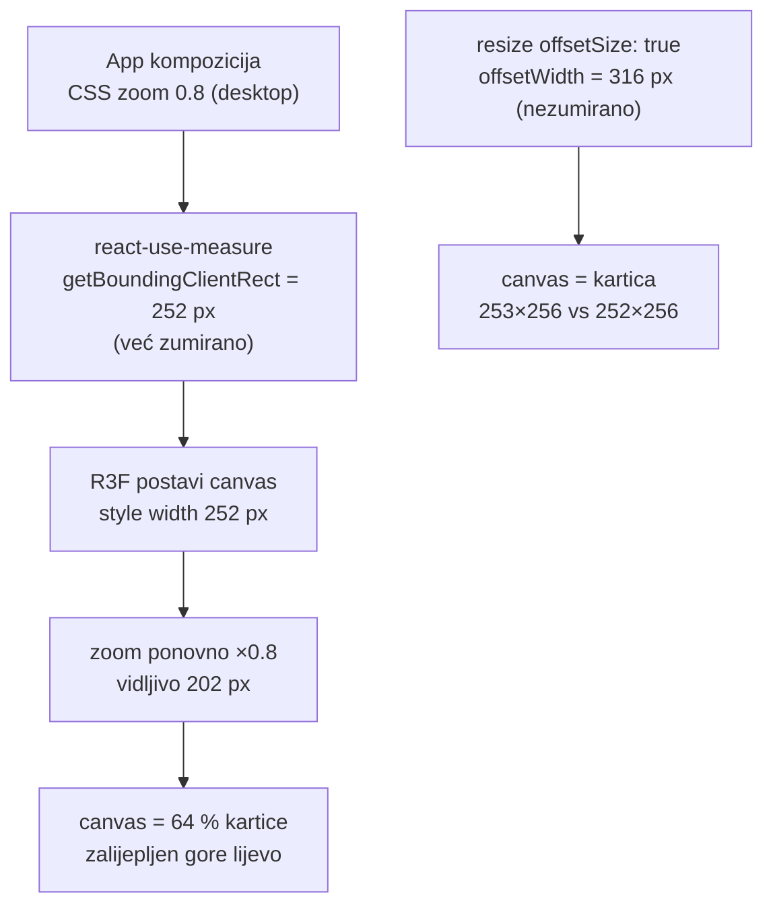

# Revizija prototipa i Backport 2 — 26. rujna 2026.

Prvi prolaz s Claude Opus 5.5. Sustavna revizija (sigurnost + UI), deploy na novu domenu
**dbhz-prototip.domovina.ai**, centriranje 3D biste i Backport 2 iz funkcionalnog novčanika.
Ovaj dokument čuva ono što se ne vidi iz diffova: mjerenja, odbačene alternative, zamke i otvorene
stavke. Konvencije su u [`CLAUDE.md`](../CLAUDE.md), plan backporta u [`BACKPORT-PLAN.md`](BACKPORT-PLAN.md).

## 1. Sigurnost — nalazi i mjerenja

| Nalaz | Posljedica prije | Popravak | Provjera |
|---|---|---|---|
| SW cache-first za SVE GET zahtjeve | `GET /api/feedback` keširan zauvijek → novi komentari nevidljivi do bumpa SW-a | `/api/*` i tuđi origini mimo SW-a; kešira se samo `200 basic`, nikad HTML za ne-navigaciju | kod + ručno |
| `/api/feedback` bez ikakve zaštite | CSRF spam formom (`text/plain`), neograničen rast indexa, GET = do 1000 KV čitanja + pisanje | Origin + `application/json`, rate limit 10/10 min/IP, max 2000, čišćenje kontrolnih znakova, GET čita samo ključeve kojih nema u indexu | `wrangler pages dev`: tuđi Origin 403, `text/plain` 415, 10. zahtjev 429, `\u0007` uklonjen |
| Nema sigurnosnih zaglavlja | clickjacking, bez CSP-a | `_headers`: CSP `script-src 'self'`, `frame-ancestors 'none'`, HSTS… | konzola čista na svim ekranima i `/dokumenti` |
| `npm audit --omit=dev` | dompurify, mermaid, fflate | `npm audit fix` | 0 ranjivosti |

CSP je otkrio jednu skrivenu ovisnost: drei `useGLTF` po defaultu instancira **meshopt dekoder (inline
WASM)** i Draco s gstatic.com. GLB nije komprimiran → `useGLTF(MODEL, false, false)`. Da se model ikad
komprimira, CSP treba `'wasm-unsafe-eval'` + gstatic u `connect-src`.

**Odbačeno:**
- *Honeypot* u API-ju — botovi šalju JSON izravno, honeypot hvata samo HTML forme.
- *Turnstile* — wrangler OAuth nema `challenge-widgets` scope; za prototip s 0 komentara rate limit je dovoljan.
  Za produkciju: Cloudflare Access ili Turnstile (zapisano u CLAUDE.md).
- *Vite 5 → 8* (esbuild advisory) — dev-only ranjivost, a skok traži plugin-react 6 / rolldown; nije vrijedno
  rizika u reviziji. Otvoreno (§5).

## 2. 3D bista necentrirana na desktopu — uzrok izmjeren

Izmjereno u pravom Chromeu (chrome-devtools MCP): prije canvas 202×205 u kartici 252×256; poslije 253×256 na
1440 i 1024 px, na mobitelu 358×320 = kartica. Pomak modela od centra (analiza piksela) 1,8 % širine — ostatak je
asimetrija siluete pri rotaciji. Katalog dbhz-3d-modeli nije imao problem jer nema `zoom`.

Ostale UI zamke iz revizije: fork je zamjenom navodnika napravio mojibake `Zmajaâ€\x9d` (Onboarding, bio na
produkciji jedan deploy) — nakon masovnih zamjena teksta traži `[\u0080-\u009f]|â` u `src/`.

## 3. Domena dbhz-prototip.domovina.ai

1. `POST /accounts/:id/pages/projects/dbhz-prototip/domains` (wrangler OAuth token radi).
2. CNAME ručno u dashboardu — OAuth nema DNS scope.
3. Domena ostaje `pending` („CNAME record not set”) i nakon što DNS radi → `PATCH …/domains/<domena>` →
   `active` za ~1,5 min.
4. Ako je domena `dig`-ana prije nego je zapis postojao, macOS i Chrome pamte NXDOMAIN → provjera
   `curl --resolve dbhz-prototip.domovina.ai:443:104.21.39.92`.

Stara `dbhzw-prototip.domovina.ai` i dalje pokazuje na isti projekt. Na novoj domeni potvrđeno: 200, CSP, SW v8,
GLB `model/gltf-binary`, OG slika, API prihvaća vlastiti Origin, odbija tuđi.

## 4. Backport 2 — zašto baš ovi izvori

Pregled loze (12+ repoa): jedini pravi self-custody kod i najbogatija dokumentacija su u
`~/git/domovinatv/pay.domovina.ai` (16 ADR-ova, postmortem, review, testovi); od prototipova je nakon Backporta 1
samo e-demokracija dobila nešto novo (`ROADMAP.md`, pitch). Pouka zapisana i u
`novcanik-template/LOZA-NOVCANIKA.md` (točka 12): **funkcionalni novčanik je izvor znanja, prototipovi izvor UI
primitiva.**

Mjerenje čitljivosti dijagrama na mobitelu (mjerilo = prikazana širina / viewBox): dva nova dijagrama bila su
0,19 i 0,22 (nepovezani subgraphovi / čvorovi u TB padaju u jedan red) → 0,38 i 0,44 nakon `A ~~~ B` i
`%% smjer: fiksan`. Postojeći dokumenti imaju dva dijagrama oko 0,26 (`uvjeti-koristenja` zadnji,
`mogucnosti` prvi) — nisu dirani.

## 5. Otvoreno

- **iOS/Safari i instalirana PWA** nisu testirani: UpdateBanner tok, inline `touch-action: pan-y` na bisti
  (vertikalni swipe scrolla, horizontalni vrti), fullscreen overlay.
- **Pravila M-od-N (primjer 5-od-9) i whitelist isplata** su prijedlog, ne odluka Družbe — potvrditi s
  Meštarskim zborom prije prezentacije.
- **Atribucija biste** i dalje nepotvrđena (caveat u sceni).
- Dev-only esbuild/vite 5 advisory (upgrade na Vite 8 kad se bude diralo build).
- Dva postojeća mermaid dijagrama ~0,26 mjerila na mobitelu.
- Feedback je javan bez prijave (rate limit, bez autentikacije) — za produkciju Access/Turnstile.
- Isti Backport 2 mogu preuzeti ostali prototipovi loze iz ovog repoa.

## Vezani dokumenti

- [`BACKPORT-PLAN.md`](BACKPORT-PLAN.md) — Backport 1 i 2 (izvori + commit hashevi)
- [`compliance/sigurnost-i-skrbnistvo.md`](compliance/sigurnost-i-skrbnistvo.md) · [`compliance/plan-razvoja.md`](compliance/plan-razvoja.md)
- [`3d-bista-tehnicki-vodic.md`](3d-bista-tehnicki-vodic.md) — pipeline modela, FitCamera, fullscreen
