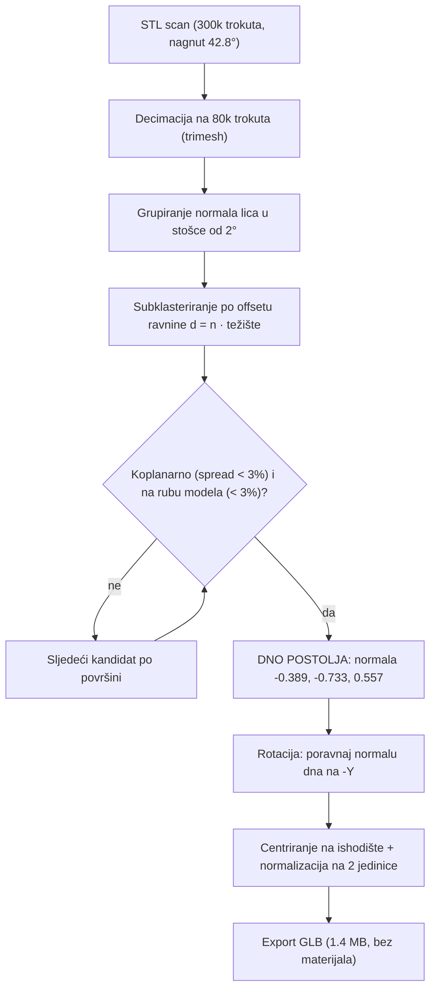
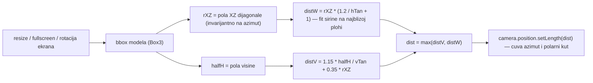
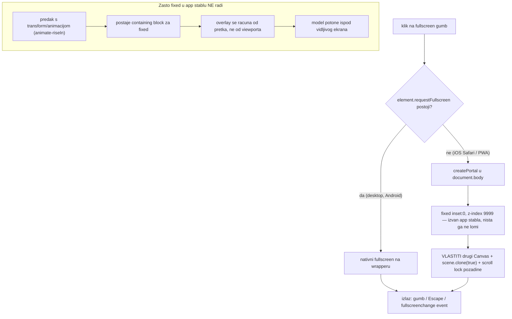
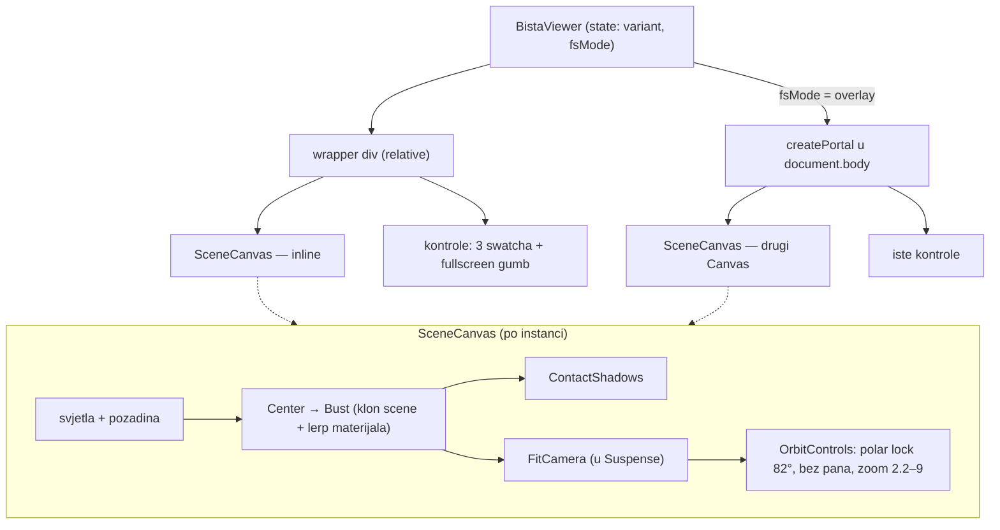

# 3D bista kralja Tomislava — tehnički vodič

Trajna dokumentacija svega naučenog pri izradi 3D crowdfunding featurea (ekran `bista`).
Komponenta: `src/screens/BistaViewer.tsx` (wallet) · standalone razvoj:
[github.com/stepanic/dbhz-bista-3d](https://github.com/stepanic/dbhz-bista-3d) ·
model-pipeline: `scripts/fix_upright.py`.

Stack: three.js `0.169` + `@react-three/fiber@8` + `@react-three/drei@9` (React 18),
lazy-loadano da three.js (~915 KB chunk) ne uđe u glavni bundle.

---

## 1. Pipeline modela: STL scan → uspravan GLB

Ključno otkriće: **3D scan je nagnut 42.8°** unutar vlastitih osi. Prva verzija
konverzije (`stl2glb.py`) nije rotirala model — oslanjala se na pretpostavku
"najveći raspon = vertikala", pa je bista u vieweru stajala nakrivljeno.

Ispravak je **čisto geometrijski, bez ikakve vizualne detekcije**: ravno dno
postolja je jedina velika koplanarna ploha na rubu modela — jednoznačan marker
uspravnog položaja. Njegova normala mora gledati točno prema dolje (−Y).

Zašto subklasteriranje po offsetu: samo grupiranje po smjeru normale miješa više
paralelnih ravnina (npr. dno + unutrašnjost šuplje baze) — grupa izgleda velika,
ali nije jedna ploha. Tek (smjer + offset) klaster = stvarna ravnina.

Pouka: **za svaki budući scan s ravnim postoljem isti pristup radi out-of-the-box**
— pokrenuti `python3 scripts/fix_upright.py` (čita STL iz `~/Downloads`).

## 2. Rotacija zaključana na vertikalnu os

Zahtjev: bista se vrti samo lijevo-desno (360°), kao da stoji na stolu; pogled se
ne smije okrenuti naglavačke niti ispod postolja.

Dva neovisna mehanizma:

1. **Uspravnost modela** — garantirana geometrijom (poglavlje 1), ne kamerom.
2. **Zaključana kamera** — `OrbitControls` s `minPolarAngle === maxPolarAngle`
   (82° od zenita = 8° iznad horizonta) + `enablePan={false}`. Jedina preostala
   sloboda je azimut; zoom ograničen (`minDistance`/`maxDistance`).

## 3. FitCamera — responzivno kadriranje

Problem: fiksna udaljenost kamere kadrira dobro u širokoj kartici, ali u
**portrait fullscreenu** horizontalni FOV je uzak pa se bista reže sa strana.

Rješenje: na svaku promjenu veličine viewporta (fullscreen, rotacija ekrana)
izračunaj udaljenost tako da cijeli model stane po visini **i** širini. Dvije
suptilnosti bez kojih kadar i dalje reže model:

- **Horizontalni cirkumradius umjesto širine**: bista se vrti — na dijagonalnim
  azimutima projicirana širina doseže polovicu XZ **dijagonale** boxa
  (`rXZ = hypot(x, z) / 2`), ne `x / 2`.
- **Fit na najbližoj plohi**: perspektiva povećava dijelove bliže kameri, pa se
  širina fita na udaljenosti `dist − rXZ`, ne u centru modela.

`FitCamera` živi **unutar `Suspense`** — mounta se tek kad je GLB učitan pa bbox
postoji. Mijenja samo udaljenost; smjer pogleda (azimut + fiksni polar) ne dira.

## 4. Fullscreen: nativni API + portal fallback (iOS bug)

iOS Safari/PWA nema Fullscreen API za elemente → treba CSS fallback. Prva verzija
(`position:fixed` overlay na wrapperu unutar app stabla) na iPhoneu je davala
**"model potonuo ispod ekrana"** — vidljiv samo vrh krune pri dnu.

Uzrok: **containing block**. `position:fixed` se računa od viewporta *samo ako
nijedan predak nema transform/animaciju/filter*. Ekran ima ulaznu animaciju
`animate-riseIn` (transform) → fixed se računao od pretka → overlay se razvukao
preko cijelog scroll-sadržaja → model, uredno centriran u toj ogromnoj površini,
završio ispod vidljivog viewporta.

Dvije netrivijalne posljedice portala:

- **Klon GLTF scene je obavezan**: `useGLTF` kešira jedan `THREE.Object3D`, a isti
  objekt ne može biti u dva scene grapha (inline canvas + overlay canvas) — drugi
  canvas bi ga "ukrao" prvome. Zato `Bust` radi `scene.clone(true)` (geometrija se
  dijeli, GPU upload po rendereru — jeftino).
- **Repro na desktopu bez iPhonea**: u devtools konzoli
  `delete Element.prototype.requestFullscreen; delete Element.prototype.webkitRequestFullscreen;`
  pa klik na gumb → forsira se overlay put identičan iOS-u.

## 5. Materijali s animiranim prijelazom

Model iz STL-a nema teksture — cijela bista je **jedan `MeshStandardMaterial`**
(boja + metalness + roughness). Zato je prijelaz između varijanti trivijalan:
u `useFrame` se sva tri parametra eksponencijalno prigušeno lerpaju prema cilju
(`k = 1 − e^(−4.5·dt)`, ~1 s, frame-rate neovisno). Animira se i karakter
površine, ne samo boja.

| Varijanta | Boja | Metalness | Roughness | Dojam |
|---|---|---|---|---|
| `bronca` | `#b07d44` | 0.78 | 0.42 | sjajni metalni odljev |
| `kamen` | `#e9e4d3` | 0.02 | 0.93 | mat bijeli brački kamen |
| `patina` | `#5b9b82` | 0.28 | 0.74 | korodirana bronca, verdigris |

Deep-link: `?screen=bista&materijal=kamen|patina|bronca` — služi za dijeljenje i
headless testiranje varijanti.

## 6. Verifikacija — što (ne) vjerovati

- **Headless Chrome + SwiftShader** (`--enable-unsafe-swiftshader --use-gl=angle
  --use-angle=swiftshader`): uz autoRotate `--virtual-time-budget` VISI (rAF drži
  virtual time) → koristiti `--headless=new --timeout=N`. Povremeno flaky (prazan
  frame → ponoviti). ⚠️ **Nepouzdan za provjeru kadriranja/kamere** — pokazivao je
  staru udaljenost kamere iako je kod bio ispravan.
- **Mjerodavna verifikacija: pravi Chrome kroz chrome-devtools MCP** —
  `new_page` + `resize_page` + `click` (CDP klik je trusted gesture, pa i
  `requestFullscreen` radi) + `evaluate_script` za čitanje runtime stanja
  (npr. `camera.position.length()` preko privremenog debug globala).
- Redoslijed koji se isplatio: prvo **izmjeri** (bbox, kut nagiba, udaljenost
  kamere), pa tek onda mijenjaj kod — svaki od tri velika buga (nagib, kadar,
  overlay) riješen je mjerenjem uzroka, ne pogađanjem.

## 7. Sažetak arhitekture komponente

---

*Napomena o sadržaju: autorstvo fizičke biste i svi iznosi u kampanji su
ilustrativni demo (v. `mock.ts` i CLAUDE.md — atribucijski caveat).*
