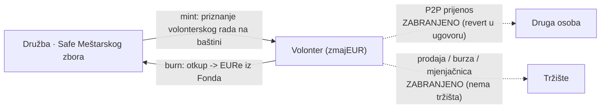
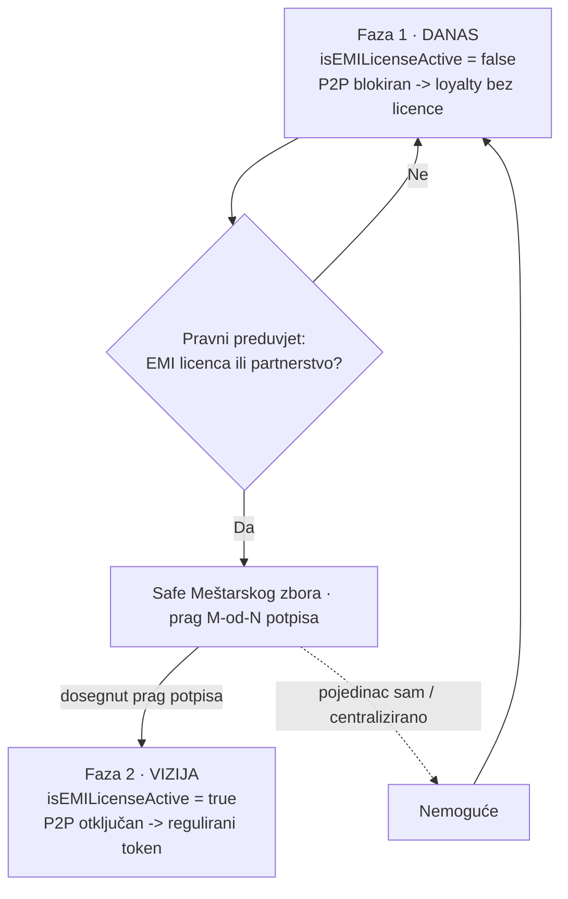

# Pravno-tehnička bilješka: zmajEUR — interni token lojalnosti Družbe „Braća Hrvatskoga Zmaja"

**Predmet:** Pravna klasifikacija tokena `zmajEUR` kao instrumenta zatvorenog kruga lojalnosti (potvrda volonterskog rada na baštini), bez potrebe za EMI licencom u Fazi 1.
**Status:** Faza 1 — *Closed-Loop Loyalty* (zatvoreni krug, bez P2P).
**Verzija:** nacrt 0.1 · 20. lipnja 2026.
**Autor:** interni nacrt (proizvodni tim)

> ⚠️ **Disclaimer.** Ovo je interna radna analiza, **ne pravni savjet**. Klasifikacija tokena ovisi o konačnoj prosudbi nadležnih tijela (HNB za e-novac/platne usluge, HANFA za financijske instrumente) i mora ju potvrditi odvjetnik specijaliziran za fintech/MiCA prije javnog lansiranja. Dokument služi kao temelj za tu provjeru i za usklađivanje koda s pravnim okvirom.

---

## 1. Sažetak

`zmajEUR` je interni digitalni token koji Družba „Braća Hrvatskoga Zmaja" izdaje **kao potvrdu volonterskog rada na baštini** — rada na obnovi spomenika, vodstva posjetitelja u Kuli nad Kamenitim vratima, digitalizacije arhiva, istraživanja i vođenja tečaja glagoljice. Token je vezan uz euro u omjeru 1:1 isključivo kao **obračunska jedinica priznanja**, a ne kao sredstvo plaćanja.

U Fazi 1 `zmajEUR` **pravno ne predstavlja elektronički novac (EMT/e-money) niti financijski instrument**, jer je programski i pravno postavljen unutar **izuzeća za ograničenu mrežu** (*Limited Network Exclusion*, PSD2 / Zakon o platnom prometu / Zakon o elektroničkom novcu) i izvan dosega **MiCA** (Uredba (EU) 2023/1114) za tokene e-novca. Temeljni štit je **potpuna zabrana P2P prijenosa u pametnom ugovoru**.

Arhitektura je namjerno pripremljena za **Fazu 2**: jednom kad (i ako) Družba ishodi EMI licencu ili sklopi partnerstvo s licenciranim izdavateljem e-novca, conditional flag u ugovoru otključava P2P i `zmajEUR` se može transformirati u regulirani token vezan uz euro.

---

## 2. Model tokena (kako zmajEUR funkcionira)

| Svojstvo | Opis |
|---|---|
| **Izdavanje (mint)** | Isključivo Družba (riznica Safe) mintsa `zmajEUR` na novčanik volontera kao potvrdu obavljenog volonterskog rada na baštini. Token se **ne kupuje** za novac. |
| **Prijenos** | **Onemogućen** (soulbound). Volonter A ne može poslati `zmajEUR` osobi B. `transfer`/`transferFrom` revertaju za sve osim odobrenih tokova (mint, burn). |
| **Otkup (burn → isplata)** | Volonter može `zmajEUR` zamijeniti za `EURe` iz **„fonda za isplate"** Družbe — **diskrecijski, ovisno o dostupnosti sredstava**. Otkup spali (burn) `zmajEUR` i Družba isplati EURe. |
| **Vrijednost** | Fiksno 1 `zmajEUR` = 1 € obračunske vrijednosti. Nema sekundarnog tržišta, ne kotira na mjenjačnicama, ne može narasti iznad nominale. |
| **Sekundarno tržište** | Ne postoji. Nema burze, nema P2P, nema špekulacije. |

### Zatvoreni krug — dopušteni i zabranjeni tokovi



---

## 3. Zašto zmajEUR (Faza 1) NIJE elektronički novac

### Korak 1 — Zabrana P2P prijenosa u kodu (temeljni štit)

Da bi token bio „novac" ili „valuta", mora služiti kao **opće sredstvo razmjene**. U pametnom ugovoru `zmajEUR` funkcije `transfer` i `transferFrom` su zaključane:

- **Volonter A ne može poslati `zmajEUR` osobi B.**
- Token se kreće isključivo: (a) **Družba → volonter** (mint, kao priznanje rada na baštini), i (b) **volonter → Družba** (burn, pri otkupu za EURe).

**Pravni učinak:** bez P2P prometa token gubi svojstvo općeg platnog sredstva. Pravno prestaje biti novac i postaje **namjenska potvrda doprinosa / interni vaučer**.

### Korak 2 — Izuzeće za ograničenu mrežu (*Limited Network Exclusion*)

PSD2 (i Zakon o platnom prometu / Zakon o elektroničkom novcu RH) izuzimaju instrumente koji se koriste **unutar ograničene mreže** ili za **ograničen spektar roba/usluga**.

- `zmajEUR` se koristi unutar jedne zatvorene mreže — **jedne udruge (Družbe) i njezinih odobrenih namjena** (otkup iz fonda Družbe).
- Ne služi za kupnju robe/usluga na otvorenom tržištu.

**Pravni učinak:** isti pravni status kao bodovi lojalnosti zatvorenog kruga (MultiPlusCard, DM Active Beauty, interni vaučeri). Za izdavanje takvih bodova ne treba licenca središnje banke.

### Korak 3 — Status prema MiCA (EU 2023/1114)

MiCA strogo regulira **tokene e-novca (EMT)** — tokene koji stabiliziraju vrijednost referenciranjem na službenu valutu i namijenjeni su kao sredstvo razmjene. Ključno za `zmajEUR`:

- `zmajEUR` se **ne može slobodno prenositi** izvan odobrenih tokova izdavatelja i **nema sekundarno tržište** → ne djeluje kao sredstvo razmjene namijenjeno javnosti.
- Ne nudi se javnosti radi kupnje niti se uvrštava na platforme za trgovanje.

**Pravni učinak:** budući da nije prenosiv i nema tržište, izostaju ključna obilježja EMT-a; token ostaje u zoni internog programa lojalnosti.

> **Napomena o preciznosti (ispravak čestog miješanja pojmova):** osnova za izuzeće je **ne-prenosivost + ograničena mreža + nepostojanje sekundarnog tržišta**, a **ne** „jedinstvenost/nezamjenjivost" (NFT). `zmajEUR` jest fungibilan (1 = 1 €), ali je **soulbound** — i to ga, uz zatvoreni krug, drži izvan EMT okvira. Argument se mora graditi na ne-prenosivosti, ne na NFT-svojstvu.

### Korak 4 — Zašto NIJE financijski instrument (HANFA)

Da bi token bio *security*, kupuje se s očekivanjem profita iz truda treće strane.

- `zmajEUR` ima **fiksnu vrijednost 1:1** prema euru; ne može narasti.
- Nema dividende, prinosa, špekulacije ni trgovanja. Dodjeljuje se za **rad**, ne kao investicija.

**Pravni učinak:** nema obilježja financijskog instrumenta → izvan nadležnosti HANFA-e.

### Korak 5 — Tokovi stvarnog novca (kako se izbjegava status primatelja depozita)

`zmajEUR` se **ne kupuje** za novac (nema priljeva novca od korisnika u zamjenu za token), pa Družba ne prima „pologe":

1. **Izdavanje:** Družba mintsa `zmajEUR` za **obavljeni volonterski rad na baštini** — to je priznanje doprinosa, ne prodaja tokena.
2. **Otkup:** kad volonter želi unovčiti `zmajEUR`, Družba ih spali i isplati **EURe iz vlastitog „fonda za isplate"**, **ovisno o dostupnosti**. To je isplata naknade, ne *withdrawal* s burze.

> **Osjetljiva točka (load-bearing):** otkup mora biti formuliran kao **diskrecijska naknada ovisna o dostupnosti fonda**, a **ne** kao **zajamčeni 1:1 claim na zahtjev**. Zajamčeni otkup na zahtjev približava token definiciji potraživanja/e-novca. Ovo je granica koju treba pažljivo držati i u kodu i u uvjetima korištenja.

---

## 4. Terminologija (kako predstavljati zmajEUR)

Radi izbjegavanja nepotrebnih regulatornih „crvenih alarma", u službenoj komunikaciji i dokumentaciji:

- **IZBJEGAVATI:** *kriptovaluta, stablecoin, digitalni novac, platni promet, investicija, isplata na zahtjev.*
- **KORISTITI:** *interni program lojalnosti, potvrda volonterskog rada na baštini/doprinosa, bodovi zajednice, priznanje volonterskog rada, namjenski vaučer.*

(U korisničkom sučelju novčanika već se koristi formulacija „potvrda rada", „ne-prenosivo", „zamjena iz fonda za isplate, ovisno o dostupnosti".)

---

## 5. Faza 2 — conditional flag: od lojalnosti do reguliranog tokena

Pametni ugovor je pripremljen s „prekidačem" koji razdvaja *loyalty* režim od reguliranog režima:

```solidity
bool public isEMILicenseActive = false; // Faza 1: P2P blokiran

// u _update / _beforeTokenTransfer:
// ako !isEMILicenseActive -> dopušteni su samo mint (from == 0)
//                            i burn/otkup (to == riznica) ; sve ostalo revert.
// ako  isEMILicenseActive -> standardni ERC-20 prijenosi (P2P) dopušteni.
```

- **Faza 1 (`false`):** kod prisilno blokira P2P → siguran *loyalty* status bez licence.
- **Faza 2 (`true`):** tek **nakon** ishođenja EMI licence (ili partnerstva s licenciranim izdavateljem e-novca) flag se prebacuje; P2P se otključava i `zmajEUR` postaje regulirani token vezan uz euro.

**Važno:** sam flag **ne stvara** pravo na P2P — pravni temelj je licenca/partnerstvo. Flag je samo tehnička poluga koja se aktivira **kad i ako** pravni preduvjeti budu ispunjeni. Prebacivanje flaga bez licence ne bi bilo usklađeno.

**Tko može prebaciti zastavicu (decentralizacija):** nijedan pojedinac. Zastavicu mijenja isključivo Meštarski zbor kroz Safe s višestrukim potpisom (prag M-od-N), i to tek nakon ispunjenja pravnog preduvjeta.



---

## 6. Load-bearing ograničenja (što se NE smije narušiti u Fazi 1)

1. **Nema P2P.** `transfer`/`transferFrom` između korisnika moraju revertati na razini ugovora (ne samo u UI-u).
2. **Otkup je diskrecijski**, ovisan o dostupnosti fonda — ne zajamčeni claim na zahtjev.
3. **Nema sekundarnog tržišta** — token se ne uvrštava na burze/mjenjačnice, nema likvidnosnih pulova.
4. **zmajEUR se ne prodaje** za novac — samo se mintsa za volonterski rad na baštini/doprinos.
5. **Terminologija** dosljedno „loyalty/vaučer", ne „stablecoin/novac".

Narušavanje bilo koje točke gura `zmajEUR` prema klasifikaciji EMT-a (→ EMI licenca/autorizacija).

---

## 7. Odnos prema EURe (Monerium) na strani otkupa

Fond za isplate drži **EURe** (Monerium EUR e-money token na Gnosisu). Otkup `zmajEUR → EURe` je isplata Družbe u već-reguliranom e-novcu (EURe izdaje licencirani EMI Monerium). Treba provjeriti:

- da isplata EURe iz fonda Družbe ne ulazi u „hold-and-forward" obrazac koji Monerium BToS ograničava (vidi compliance SSOT `pay.domovina.ai/docs/compliance` i bilješku o Monerium BToS §16);
- da je fond Družbe tehnički Safe pod kontrolom Družbe, a isplata = obična EURe transakcija.

---

## 8. Preporuke / sljedeći koraci

1. **Pravna potvrda:** dati ovu bilješku odvjetniku (fintech/MiCA) i, po potrebi, neformalno provjeriti s HNB-om status „ograničene mreže".
2. **Uskladiti kod s tezom:** osigurati da ne-prenosivost i diskrecijski otkup budu *enforced* u Solidityju (ne samo u prototipu/UI-u).
3. **Uvjeti korištenja (ToS):** napisati uvjete `zmajEUR` programa koji jasno opisuju: potvrda rada, ne-prenosivost, otkup ovisan o dostupnosti fonda.
4. **Registar mintova:** voditi auditabilan zapis „volonterski rad na baštini → mint" radi transparentnosti (usklađeno s vrijednošću transparentnosti Družbe).
5. **Tek po licenci** razmotriti Fazu 2 (`isEMILicenseActive = true`).

---

## Reference

- Uredba (EU) 2023/1114 (**MiCA**) — osobito odredbe o tokenima e-novca (EMT) i izuzeća (čl. 2).
- Direktiva (EU) 2015/2366 (**PSD2**) — izuzeće za ograničenu mrežu.
- Zakon o elektroničkom novcu (RH), Zakon o platnom prometu (RH).
- Interni compliance SSOT: `pay.domovina.ai/docs/compliance/` (provider model, Monerium BToS).
- Izvorni pravno-tehnički pregled (loyalty → EMI flag arhitektura), interni dokument.

---

## 9. Proširena korisnost u Družbi (volonterski program na baštini)

Družba proširuje korisnost `zmajEUR` unutar **volonterskog programa na baštini** — priznavanje različitih oblika doprinosa očuvanju i obnovi hrvatske kulturne i povijesne baštine. Sve petlje moraju ostati unutar Faze 1 (bez EMI licence):

- **Mint za više vrsta rada.** Osim rada na obnovi spomenika, `zmajEUR` se mintsa i za **vodstvo posjetitelja, digitalizaciju arhiva, istraživanje i vođenje tečaja glagoljice**. Svaki mint je **potvrda obavljenog rada**, ne prodaja tokena; vrijednost ostaje fiksna na 1 € (nema rasta iznad nominale).
- **„Limited network" ostaje održan.** Izdavatelj je **jedna udruga (Družba)**, a otkup ide isključivo iz njezina fonda za isplate. To je udžbenički primjer izuzeća za ograničenu mrežu (PSD2/MiCA čl. 2). Eventualni **partnerski popusti za volontere** (whitelist suradnika Družbe) smiju se uvesti samo kao *perk* unutar zatvorenog kruga — **bez P2P-a, bez burzi, bez zajamčenog otkupa na zahtjev**.
- **Otkup ostaje diskrecijski.** Volonter `zmajEUR → EURe` zamjenjuje **isključivo kod Družbe**, ovisno o dostupnosti fonda za isplate. To čuva zatvoreni krug, daje čist KYC/porezni trag i drži token izvan EMT okvira.
- **Transparentnost mintova.** Auditabilan zapis „volonterski rad na baštini → mint" javno pokazuje da je svaki `zmajEUR` izdan za stvarni doprinos — u skladu s vrijednošću transparentnosti Družbe.

Sve navedeno usklađeno je s točkom 6 (load-bearing ograničenja) i `isEMILicenseActive` prekidačem (točka 5): proširenje korisnosti **ne** uvodi P2P niti sekundarno tržište.

---

> **Napomena o demo prototipu.** Logo i ime Družbe „Braća Hrvatskoga Zmaja" koriste se isključivo za potrebe demo prototipa. Za bilo koju produkcijsku ili javnu primjenu potrebna je suglasnost Družbe te pravna potvrda.

*Kraj nacrta. Sve tvrdnje podložne pravnoj potvrdi prije lansiranja.*
