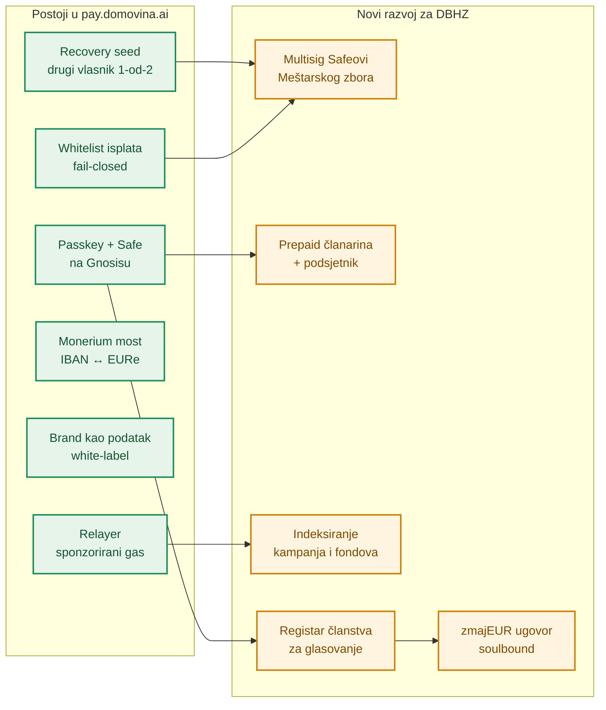
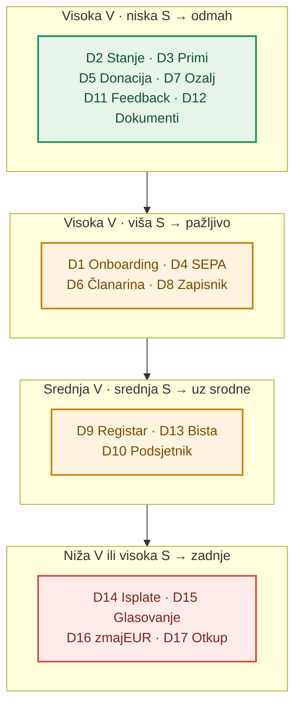
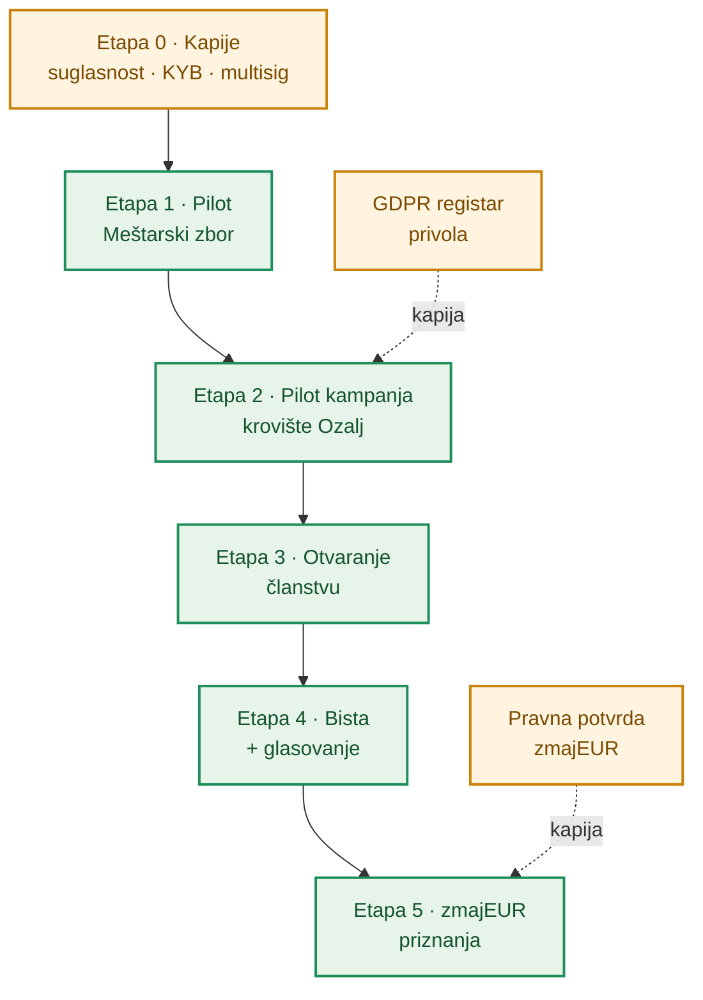

# Plan razvoja — od prototipa do pravog novčanika Družbe

**Izdavatelj:** Družba „Braća Hrvatskoga Zmaja” · OIB: 78879984090 · Kamenita ulica 3, 10000 Zagreb
**Verzija:** nacrt 0.1 · **Datum:** 26. rujna 2026.

> ⚠️ **Disclaimer.** Ovo je **radni prijedlog redoslijeda razvoja**, ne obveza ni ponuda. Ništa od opisanog ne kreće bez **suglasnosti Družbe** i odluke Meštarskog zbora. Sve ocjene, trajanja i ciljne brojke su **procjena** autora prototipa; etape nemaju kalendarske datume — fiksan je *redoslijed*, ne rok. Iznosi u prototipu su **ILUSTRATIVNI**. Ideje koje ovdje nisu razrađene vode se u dokumentu [Razmatrane mogućnosti](./razmatrane-mogucnosti.md).

---

## 1. Polazište: gdje smo danas (Faza 1 · prototip)

DBHZ novčanik je **dizajnerski prototip**: 11 ekrana + onboarding, sve na **mock podacima**, bez ijedne onchain transakcije. Služi da Meštarski zbor i članovi *vide i isprobaju* tokove prije nego što se išta gradi.

| Područje | Stanje u prototipu | Što nedostaje za produkciju |
|---|---|---|
| Donacije + solidarna kampanja „Obnova krovišta — Stari grad Ozalj” | UI, progress, usporedba naknada | stvarni EURe transfer, kampanjski Safe, brojač onchain |
| Članarina (podupiratelj 1 €/tjedno, redoviti član) | prepaid UX, izračun razdoblja | MultiSend podmirenje, podsjetnik za obnovu |
| Fondovi za baštinu (Opći, Ozalj, Digitalizacija i arhiv, Izdavaštvo) | 4 kartice s iznosima | 4 namjenska Safea pod multisigom Meštarskog zbora |
| zmajEUR priznanja | soulbound koncept, pravna bilješka | ugovor, pravilnik nagrađivanja, pravna potvrda |
| Glasovanje (1 zmaj = 1 glas) | ankete, members-only oznaka | registar članstva, potpisani glasovi, javni tally |
| Bista kralja Tomislava (3D crowdfunding) | three.js viewer, 3 materijala | kampanjski Safe, ciljevi po gradovima |
| Baština (javni registar) + Aktivnost | popis objekata i ulaganja | veza svakog unosa na onchain transakciju |
| Dokumenti, PWA, feedback widget | **gotovo** (feedback u KV-u) | prenijeti u produkciju gotovo bez izmjena |

### 1.1 Što se može preuzeti iz funkcionalnog novčanika

Razvoj ne kreće od nule. Funkcionalni DOMOVINA Wallet (`pay.domovina.ai`, dio `wallet/`) već ima jezgru koju prototip samo simulira. Ocjene složenosti u §3 **pretpostavljaju ponovnu upotrebu te jezgre**; bez nje svaka ocjena raste za ~30–40 bodova (procjena).

Realne napomene o jezgri (prema dokumentaciji funkcionalnog novčanika):

- **Passkey je vezan uz domenu** (RP ID `domovina.ai`). DBHZ novčanik na poddomeni `*.domovina.ai` dijeli istu passkey infrastrukturu; vlastita domena Družbe značila bi zaseban passkey identitet — odluka za Etapu 0.
- **Dio naprednih tokova** (više računa pod jednim passkeyem, `/recover`) prema posljednjem zapisu primopredaje bio je na staging okruženju i **nije bio provjeren onchain**. Pilot s Meštarskim zborom (Etapa 1) je upravo mjesto gdje se to provjerava na malim iznosima.
- **Lekcija iz postmortema 0001:** kampanjski Safe kojim upravlja samo jedan passkey zarobio je sredstva kad je passkey izgubljen. Zato su **svi kampanjski i fondovski Safeovi Družbe M-od-N multisig Meštarskog zbora** — vidi [Sigurnost i skrbništvo](./sigurnost-i-skrbnistvo.md).

---

## 2. Metodologija bodovanja (0–100)

Preuzeta iz roadmapa srodnog novčanika, s kriterijima prilagođenima udruzi za baštinu.

**Vrijednost (V)** — koliko rješava stvarni problem člana i Družbe:

| Kriterij | Udio | Pitanje |
|---|---|---|
| Sredstva za baštinu | 35 % | Donosi li prihod fondovima ili štedi naknade? |
| Korist za člana/donatora | 30 % | Rješava li konkretan zadatak (platiti, donirati, provjeriti)? |
| Povjerenje i transparentnost | 20 % | Je li svaki euro javno i auditabilno vidljiv? |
| Zajedništvo | 15 % | Veže li člana uz zmajski stol, sijela i projekte? |

**Složenost (S)** — trošak da radi *u produkciji*, ne u mocku:

| Raspon | Značenje (procjena trajanja) |
|---|---|
| 0–20 | gotovo u prototipu ili čisti frontend — dani |
| 21–45 | jezgra pokriva; integracija i tanki backend — 1–2 tjedna |
| 46–65 | novi backend podsustav (indeksiranje, push, registar) — 2–4 tjedna |
| 66–100 | novi pametni ugovor, identitet ili pravna provjera — mjesec i više |

**Prioritet Δ = V − S.** Veći Δ → ranije. Negativan Δ znači „kasnije, kad prethodne etape podignu vrijednost”, ne „nikad”.

---

## 3. Ocjene funkcionalnosti

| # | Funkcionalnost | V | S | Δ | Obrazloženje |
|---|---|--:|--:|--:|---|
| D2 | Stanje EURe + pregled | 85 | 15 | **+70** | bez stanja nema novčanika; jezgra već čita onchain |
| D5 | Donacija u fond za baštinu | 90 | 40 | **+50** | glavni tok prihoda, bez provizije; treba 4 multisig Safea |
| D3 | Primi: QR / adresa (EIP-681) | 60 | 15 | **+45** | osnovna funkcija; jezgra ima EIP-681 |
| D6 | Prepaid članarina 1 €/tjedno | 95 | 50 | **+45** | killer-argument: nalog 0,25–0,40 € = 25–40 % tjedne članarine |
| D1 | Onboarding: passkey + Safe + seed | 90 | 45 | **+45** | preduvjet svega; jezgra postoji, treba DBHZ brand i provjeru |
| D4 | SEPA nadoplata (Monerium) | 85 | 45 | **+40** | most iz banke; treba KYB Družbe i whitelist odredišta |
| D7 | Solidarna kampanja Ozalj | 70 | 35 | **+35** | jasan, emotivan cilj; kampanjski Safe + brojač |
| D11 | Feedback Meštarskog zbora | 40 | 10 | **+30** | već radi u prototipu; ključan za reviziju ocjena |
| D12 | Dokumenti + PWA | 35 | 5 | **+30** | gotovo; povjerenje i distribucija bez trgovine aplikacija |
| D8 | Javni zapisnik + GDPR opt-in | 80 | 50 | **+30** | srž povjerenja; indeksiranje + registar privola |
| D9 | Javni registar baštine | 60 | 30 | **+30** | sadržaj postoji; treba veza unosa na transakciju |
| D13 | Bista kralja Tomislava — crowdfunding | 65 | 40 | **+25** | 3D viewer gotov; ponovno koristi kampanjski Safe iz D7 |
| D10 | Podsjetnik za obnovu članarine | 55 | 45 | **+10** | bez njega prepaid „curi”; web-push + scheduler |
| D14 | Isplate iz fondova (whitelist, MultiSend) | 50 | 60 | **−10** | važno za izvođače i volontere; multisig tokovi + UX |
| D15 | Glasovanje 1 zmaj = 1 glas | 60 | 70 | **−10** | engagement; treba registar 385 članova i potpisane glasove |
| D17 | Otkup zmajEUR → EURe | 30 | 70 | **−40** | smisleno tek uz kritičnu masu zmajEUR-a |
| D16 | zmajEUR soulbound priznanja | 45 | 85 | **−40** | novi ugovor + pravna potvrda MiCA granice |

### 3.1 Matrica vrijednost × složenost

---

## 4. Etape isporuke

Da se ne miješaju s „Fazom 1/2” iz pravnih dokumenata (Faza 1 = bez P2P, Faza 2 = EMI licenca), korake isporuke zovemo **etapama**. Svaka etapa je samostalna, upotrebljiva cjelina i završava provjerljivim izlaznim kriterijem.

### Etapa 0 · Kapije (prije ijednog eura)

Nije razvoj, nego preduvjeti koji traju neovisno o kodu — pokreću se odmah i usporedno:

1. **Suglasnost Družbe** za upotrebu imena „Braća Hrvatskoga Zmaja” i zmajskog grba u produkciji (danas samo demo).
2. **Monerium poslovni račun Družbe (KYB)** — uplate idu na vlastiti račun Družbe, ne kroz tuđi IBAN.
3. **Multisig Meštarskog zbora:** odluka o pragu M-od-N (npr. 5-od-9 — većina Meštarskog zbora, Veliki meštar + 8 meštara; *prijedlog*, ne odluka) i o potpisnicima; svaki potpisnik s vlastitim uređajem + rezervnim ključem. Bez toga se ne otvara nijedan fondovski ni kampanjski Safe.
4. **Whitelist isplata:** popis odobrenih računa (izvođači obnove, tiskara, Družbin IBAN) — isplata na adresu izvan popisa se odbija (fail-closed).
5. **Domena i passkey identitet** (vidi §1.1) te pravni pregled uvjeta korištenja.

**Izlaz:** pisana suglasnost, otvoren KYB, zapisnik Meštarskog zbora o multisigu.

### Etapa 1 · Pilot s Meštarskim zborom — prosječni Δ ≈ +50

> **Priča:** „Meštarski zbor prvi koristi novčanik — na malim iznosima, uživo.”

**Sadržaj:** D1 onboarding · D2 stanje · D3 Primi · D4 SEPA · D5 donacija u **Opći fond** · D11, D12 prenose se gotovi.
**Zašto prva:** najmanji skup koji je *pravi novčanik*; sve kasnije ovisi o D1/D2. Mali i poznati krug (Veliki meštar + 8 meštara) idealan je za provjeru tokova koji u jezgri nisu bili provjereni onchain.
**Rizici:** KYB kasni → pilot kreće s QR-primanjem (D3) kao jedinim ulazom; skrivene brand-ovisnosti jezgre → mijenja se samo brand-podatak.
**Izlaz:** stvarna donacija end-to-end (banka → EURe → Opći fond) + jedna probna isplata M-od-N potpisima na whitelist račun.

### Etapa 2 · Pilot kampanja „Obnova krovišta — Stari grad Ozalj” — prosječni Δ ≈ +32

> **Priča:** „Svaki euro za krovište Ozlja — javno, bez provizije.”

**Sadržaj:** D7 kampanja · D8 javni zapisnik + GDPR opt-in imena · D9 registar baštine povezan s transakcijama.
**Zašto sad:** konkretan, stvaran projekt baštine daje razlog za prvu javnu objavu; zapisnik i GDPR idu zajedno jer javni popis donatora bez registra privola nije pravno ispravan.
**Rizici:** kampanjski Safe s jednim ključem = zarobljena sredstva (postmortem 0001) → kampanjski Safe je **isključivo** multisig Meštarskog zbora.
**Izlaz:** kampanja javno dostupna, brojač prikupljenog čita se onchain, donatori anonimni osim uz privolu.

### Etapa 3 · Otvaranje članstvu — prosječni Δ ≈ +28

> **Priča:** „Članarina za cijelu godinu jednim otiskom prsta.”

**Sadržaj:** D6 prepaid članarina (podupiratelji 1 €/tjedno + redoviti članovi) · D10 podsjetnik · preostala 3 fonda za baštinu (Ozalj, Digitalizacija i arhiv, Izdavaštvo).
**Zašto sad:** članarina je pojedinačno najvrjednija funkcija (V=95), ali traži stabilne tokove iz etapa 1–2. Podsjetnik ide u paketu: nema auto-debita, pa prepaid bez podsjetnika gubi obnove.
**Rizici:** web-push na iOS-u radi samo za PWA instaliranu na početni zaslon → e-mail kao zamjena; inozemni zmajski stolovi → EURe ulaz bez SWIFT troška je prednost, ali treba uputu.
**Izlaz (procjena):** prvi redoviti članovi izvan Meštarskog zbora plaćaju članarinu kroz novčanik; 4 fonda javno vidljiva.

### Etapa 4 · Bista kralja Tomislava + glasovanje — prosječni Δ ≈ +2

> **Priča:** „Pogledajte bistu u 3D-u, podržite odljev — i odlučite zajedno o prioritetima.”

**Sadržaj:** D13 bista crowdfunding (isti obrazac kampanjskog Safea kao Ozalj) · D15 glasovanje · D14 isplate iz fondova (stretch).
**Zašto sad:** bista ponovno koristi sve iz etape 2, pa je jeftina. Glasovanje ima negativan sirovi Δ, ali tek nakon etape 3 postoji **dokaz članstva** (passkey + status članarine redovitog člana) — anti-sybil se dobiva gotovo besplatno, a o fondovima i projektima ima se o čemu glasati.
**Rizici:** atribucija biste nije potvrđena → UI ostaje „potvrditi prije objave”; glasovanje je **savjetodavno** — formalne odluke donose skupština i Meštarski zbor po Pravilima Družbe. Za ankete je dovoljan potpisani glas + javna objava rezultata; puni onchain tally samo ako se pokaže potreba.
**Izlaz:** prva članska anketa provedena kroz novčanik s provjerljivim rezultatom; kampanja biste aktivna.

### Etapa 5 · zmajEUR priznanja — Δ ≈ −40, svjesno zadnja

> **Priča:** „Volonterski rad na baštini se vidi i cijeni.”

**Sadržaj:** D16 soulbound zmajEUR · D17 diskrecijski otkup iz fonda za isplate.
**Zašto zadnja:** najveća složenost (novi ugovor + pravna provjera), a vrijednost ovisi o zajednici koja već živi u novčaniku (etape 2–4).
**Kapije:** pisana pravna potvrda da zmajEUR ostaje instrument lojalnosti zatvorenog kruga (bez P2P, izvan MiCA EMT) — vidi [zmajEUR bilješku](./edeur-loyalty-token.md); pravilnik nagrađivanja koji donosi Meštarski zbor. P2P (`isEMILicenseActive`) ostaje **izvan ovog plana**.
**Izlaz:** prvi zmajEUR mintan za stvarni volonterski rad na baštini.

---

## 5. Ovisnosti na jednom mjestu

| Preduvjet | Blokira | Tko odlučuje |
|---|---|---|
| Suglasnost za ime i grb | svaku javnu upotrebu (Etapa 1+) | Družba |
| Monerium KYB Družbe | D4 SEPA (Etapa 1) | Družba + Monerium |
| Multisig M-od-N Meštarskog zbora | fondove i kampanje (D5, D7, D13, D14) | Meštarski zbor |
| Whitelist računa za isplate | D14 isplate | Meštarski zbor |
| GDPR registar privola | D8 javni zapisnik (Etapa 2) | Družba + pravni savjet |
| Registar članstva (385, numerus clausus) | D15 glasovanje | Meštarski zbor |
| Pravna potvrda zmajEUR | D16, D17 (Etapa 5) | pravni savjet |

## 6. Glavni rizici

1. **Gubitak ključa potpisnika** → prag M-od-N uvijek manji od N, rezervni ključevi, postupak zamjene potpisnika zapisan unaprijed.
2. **Neprovjerena jezgra** → pilot na malim iznosima; ništa ne ide članstvu dok Etapa 1 ne prođe izlazni kriterij.
3. **Regulatorna granica** → zmajEUR bez P2P; novčanik ne prosljeđuje tuđe uplate; porezni tretman po [Porezi i transparentnost](./porezi-i-transparentnost.md).
4. **Privatnost** → donatori anonimni po zadanom; javno ime samo uz izričitu privolu.
5. **Kapacitet razvoja** → etapa koja kasni se reže (stretch stavke prelaze dalje), ne produljuje.

## 7. Načela između etapa

1. **Svaka etapa završava produkcijom i objavom** — nema „velikog praska”.
2. **Prototip ostaje živ** kao poligon: nova ideja se prvo iterira u mocku, tek onda ulazi u plan.
3. **Feedback Meštarskog zbora** revidira ocjene V nakon svake etape — plan je živ dokument.
4. **Kapije se ne preskaču:** suglasnost i multisig prije Etape 1, GDPR prije Etape 2, pravna potvrda prije Etape 5.

> **Napomena.** Sve je prijedlog na razini prototipa. Činjenice o Družbi (osnutak 1905., Meštarski zbor, 385 članova, 24 zmajska stola) su javne; sve ocjene, trajanja i iznosi su procjena ili ilustracija. Logo i ime Družbe koriste se isključivo za demo; produkcija traži suglasnost Družbe „Braća Hrvatskoga Zmaja”.
