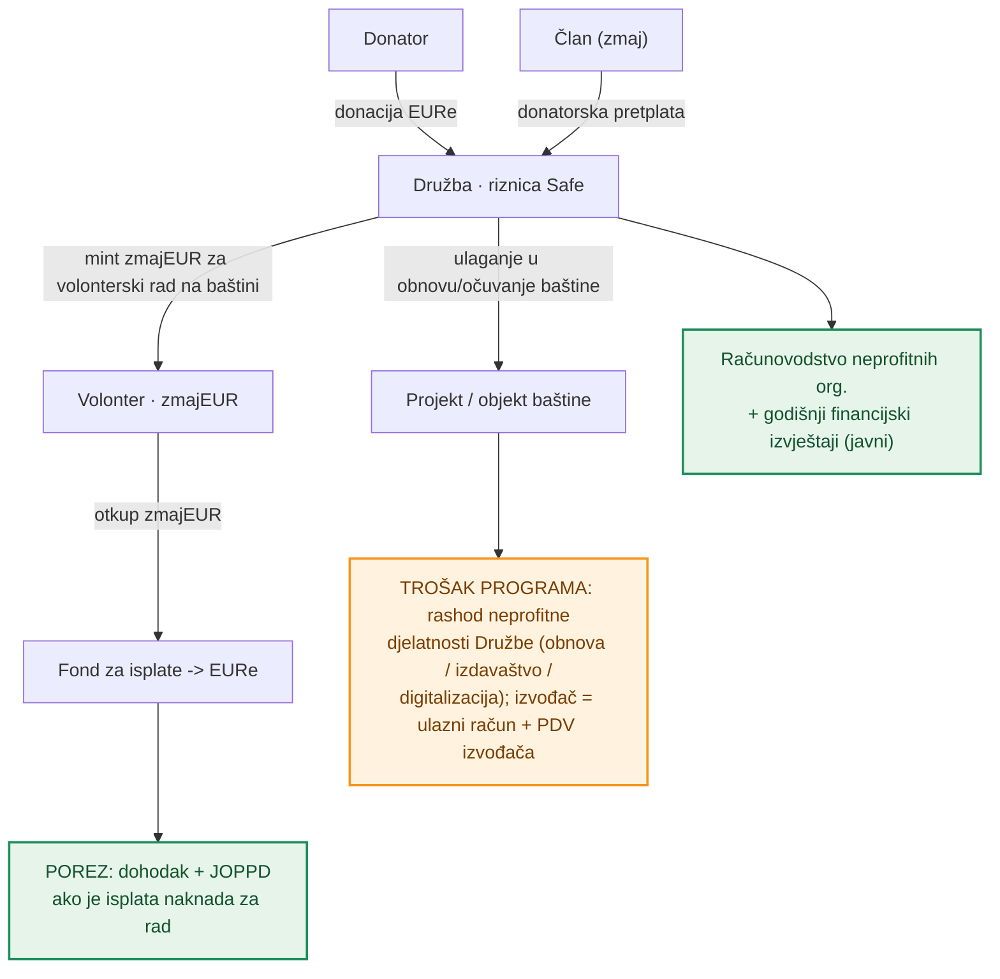
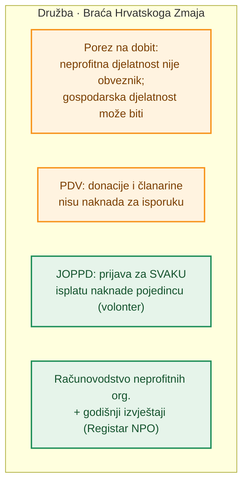
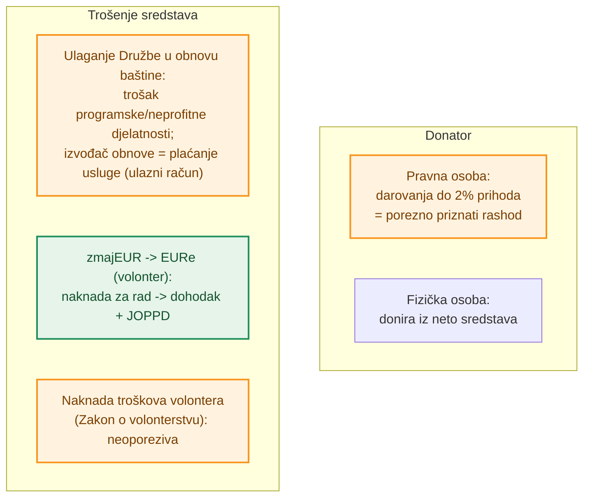
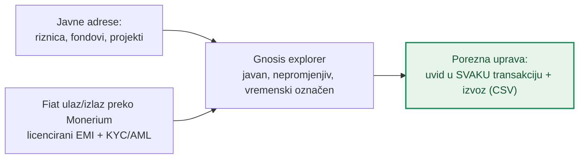

# Porezi i transparentnost — tok novca na javnom lancu

**Izdavatelj:** Družba „Braća Hrvatskoga Zmaja" · OIB: 78879984090 · IBAN: HR8923400091100055160 (PBZ) · Kula nad Kamenitim vratima, Kamenita ulica 3, 10000 Zagreb · Registar udruga RH reg. br. 00000113
**Verzija:** nacrt 0.1 · **Datum:** 20. lipnja 2026.

> ⚠️ **Disclaimer.** Ovo je interna radna analiza, **ne porezni ni pravni savjet**. Konačnu poreznu kvalifikaciju daje knjigovođa / porezni savjetnik i, po potrebi, **obvezujuće mišljenje Porezne uprave**. Brojčani pragovi i stope mijenjaju se propisima — provjeriti aktualne vrijednosti prije primjene.

---

## 1. Vizija: transparentnost umjesto „crypto scama"

Blockchain se često percipira kao netransparentan ili sumnjiv. Kod nas je **suprotno**: ovo je **javna, nepromjenjiva baza podataka** u kojoj se svaka uplata i isplata vidi — bez skrivenih računa, bez gotovine, bez „muljanja".

Cilj je da sustav bude **najprijateljskiji moguć za Poreznu upravu**: svaka transakcija je javna, vremenski označena i provjerljiva, a porezne se obveze ne skrivaju nego se **jasno vide i uredno prijavljuju**. To je transparentnije od klasičnog bankovnog računa, jer cijeli tok novca može provjeriti bilo tko — uključujući poreznog inspektora — u svakom trenutku. Za neprofitnu udrugu transparentnost je ujedno i temelj povjerenja donatora.

**Legenda boja u dijagramima:**
- 🟩 **zeleno** — točka u kojoj se **porez plaća ili prijavljuje**;
- 🟧 **narančasto** — **olakšica ili izuzeće** (porez se ne plaća, uz uvjete);
- ⬜ neutralno — uobičajeni tok sredstava.

---

## 2. Sudionici i javne adrese

Svi računi sustava su **javno objavljene adrese** na mreži Gnosis:

| Račun | Uloga | Vidljivost |
|---|---|---|
| **Riznica Safe Družbe** | prima donacije i donatorske pretplate | javna adresa, svaka uplata vidljiva |
| **Fondovi za baštinu** (Opći fond Družbe, Fond Stari grad Ozalj, Fond digitalizacije i arhiva, Fond izdavaštva) | sredstva za programe očuvanja i obnove baštine | javne adrese po fondu |
| **Projekti / objekti baštine** | namjenski Safe za konkretan projekt obnove | javne adrese po projektu |
| **Fond za isplate** | EURe za otkup zmajEUR (volonteri) | javna adresa |

EURe je **regulirani token e-novca** koji izdaje licencirani izdavatelj (Monerium), pa ulaz i izlaz u „klasične" eure ide kroz **reguliranu instituciju uz KYC/AML** (banka ↔ IBAN ↔ EURe).

---

## 3. Tok novca i porezne točke

Svaka strelica je **stvarna transakcija na lancu** — javno provjerljiva. Zelene točke označavaju gdje nastaje porezna/prijavna obveza.

---

## 4. Porezi — Družba (neprofitna organizacija)

- **Porez na dobit** — Družba kao neprofitna pravna osoba **nije obveznik poreza na dobit za svoju osnovnu, neprofitnu djelatnost** (očuvanje i obnova baštine); donacije i članarine nisu oporezivi prihod. *(Ako Družba obavlja **gospodarsku djelatnost** — npr. webshop, prodaja izdanja, kotizacije, aukcije — i time bi stekla povlašteni položaj na tržištu, Porezna uprava rješenjem može utvrditi obvezu poreza na dobit za **taj dio**, sukladno Zakonu o porezu na dobit.)*
- **PDV** — dobrovoljne donacije i članarine nisu naknada za isporuku dobara/usluga pa nisu predmet PDV-a; ulazak u sustav PDV-a dolazi u obzir tek ako **oporezive isporuke** (npr. webshop) prijeđu zakonski prag.
- **Računovodstvo** — Družba vodi računovodstvo prema **Zakonu o financijskom poslovanju i računovodstvu neprofitnih organizacija** te predaje **godišnje financijske izvještaje** u **Registar neprofitnih organizacija** (FINA/Ministarstvo financija) — javno dostupne.
- **JOPPD** — za svaku isplatu naknade pojedincu (npr. otkup zmajEUR volonteru kao naknada za rad) Družba kao isplatitelj podnosi JOPPD obrazac.

---

## 5. Porezi — Donator, ulaganje u baštinu i isplate

- **Donator — pravna osoba:** darovanja u općekorisne svrhe priznaju se kao rashod **do 2 % prihoda prethodne godine** (Zakon o porezu na dobit). Potpora očuvanju kulturne i povijesne baštine kroz neprofitnu udrugu u pravilu ulazi u općekorisne svrhe — potvrditi kvalifikaciju.
- **Donator — fizička osoba:** donira iz vlastitih (neto) sredstava; općenito bez odbitka od poreza na dohodak.
- **Trošenje sredstava — ulaganje u obnovu/očuvanje baštine:** kod Družbe se sredstva uglavnom troše na **vlastite programe očuvanja baštine** (obnova spomenika i objekata, izdavaštvo, digitalizacija arhiva). To su **rashodi neprofitne (programske) djelatnosti Družbe**, a **ne bespovratni grantovi trećim osobama**. Ako se za obnovu angažira **izvođač/obrtnik**, riječ je o **plaćanju usluge** (ulazni račun, eventualni PDV izvođača ako je u sustavu PDV-a) — to je trošak nabave usluge, a ne grant. Točan tretman pojedinog troška (programski rashod, nabava, eventualne državne potpore / *de minimis* ako bi se ipak dodjeljivala bespovratna sredstva trećoj osobi) potvrditi s poreznim savjetnikom.
- **Isplata — volonter (zmajEUR → EURe):** ako se zmajEUR (potvrda rada) **otkupljuje za EURe kao naknada za rad**, ta je isplata vrlo vjerojatno **oporezivi dohodak** (npr. drugi dohodak / ugovor o djelu) → obračun poreza na dohodak i eventualnih doprinosa, uz JOPPD prijavu Družbe. **Nije** isto što i neoporeziva **naknada troškova volonteru** po Zakonu o volonterstvu (koja je uz propisane uvjete neoporeziva). Točnu kvalifikaciju (volontiranje / naknada troškova / drugi dohodak / honorar) treba potvrditi s poreznim savjetnikom.

---

## 6. Najprijateljskije za Poreznu upravu — uvid onchain

Za poreznu reviziju ili nadzor dovoljno je otvoriti javne adrese u blockchain pregledniku:

- **svaka transakcija** je javna, vremenski označena i **nepromjenjiva** (ne može se naknadno „popraviti");
- **izvoz (CSV)** svih uplata/isplata po adresi za knjigovodstvo i poreznu provjeru;
- **fiat veza** (uplata/isplata u euro) ide kroz licenciranog izdavatelja e-novca uz KYC/AML, pa postoji uredan trag identiteta na on/off-rampi;
- javne adrese omogućuju uvid i nadzornim tijelima u okviru **nadzora neprofitnih organizacija** (Registar NPO, Ministarstvo financija);
- za razliku od gotovine ili zatvorenih sustava, **ništa nije skriveno** — transparentnost je zadana, a ne iznimka, što je za Družbu ujedno i najjači argument povjerenja prema donatorima.

---

## 7. Preporuke / sljedeći koraci

1. **Knjigovodstvo:** voditi računovodstvo neprofitne organizacije i povezivati onchain adrese s knjigovodstvenim stavkama (svaka tx → stavka).
2. **Porezna kvalifikacija troškova i isplata:** prije prvih većih izdataka zatražiti mišljenje poreznog savjetnika (i po potrebi Porezne uprave) o tretmanu **(a)** ulaganja u obnovu baštine (programski rashod vs. nabava usluge izvođača vs. eventualna potpora trećoj osobi / *de minimis*) i **(b)** otkupa zmajEUR volonteru (naknada troškova volontera vs. dohodak; JOPPD, doprinosi).
3. **Gospodarska djelatnost:** ako se uvode webshop / prodaja izdanja / kotizacije / aukcije, razgraničiti neprofitni od gospodarskog dijela i pratiti prag PDV-a te eventualnu obvezu poreza na dobit za gospodarski dio.
4. **Objava adresa:** na mrežnoj stranici objaviti javne adrese sustava radi pune transparentnosti.
5. **Izvoz i revizija:** pripremiti standardni CSV izvoz transakcija za godišnje izvještaje i eventualni nadzor.

---

## Reference

- Zakon o porezu na dobit (RH) — neprofitne osobe (čl. 2); darovanja do 2 % prihoda.
- Zakon o porezu na dohodak (RH) — dohodak, drugi dohodak, JOPPD.
- Zakon o porezu na dodanu vrijednost (RH) — prag i predmet oporezivanja.
- Zakon o financijskom poslovanju i računovodstvu neprofitnih organizacija (RH) — godišnji izvještaji, Registar NPO.
- Zakon o udrugama (RH) i Zakon o volonterstvu (RH) — naknada troškova volontera.
- Povezani interni dokumenti: [Uvjeti korištenja](./uvjeti-koristenja-novcanika.md) · [zmajEUR bilješka](./edeur-loyalty-token.md).

---

> **Napomena o demo prototipu.** Logo i ime Družbe „Braća Hrvatskoga Zmaja" koriste se isključivo za potrebe demo prototipa. Za bilo koju produkcijsku ili javnu primjenu potrebna je suglasnost Družbe te pravna potvrda.

*Kraj nacrta. Sve tvrdnje podložne pravnoj i poreznoj potvrdi prije primjene.*
