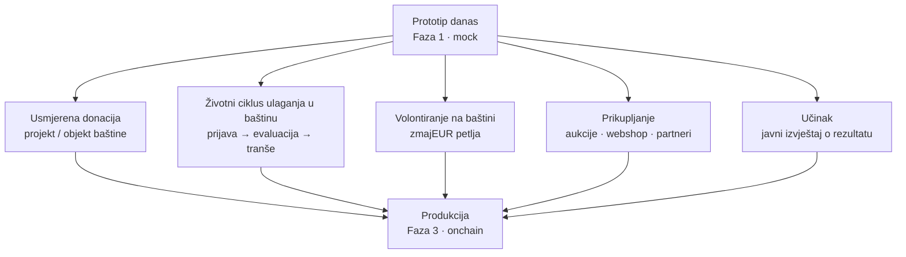
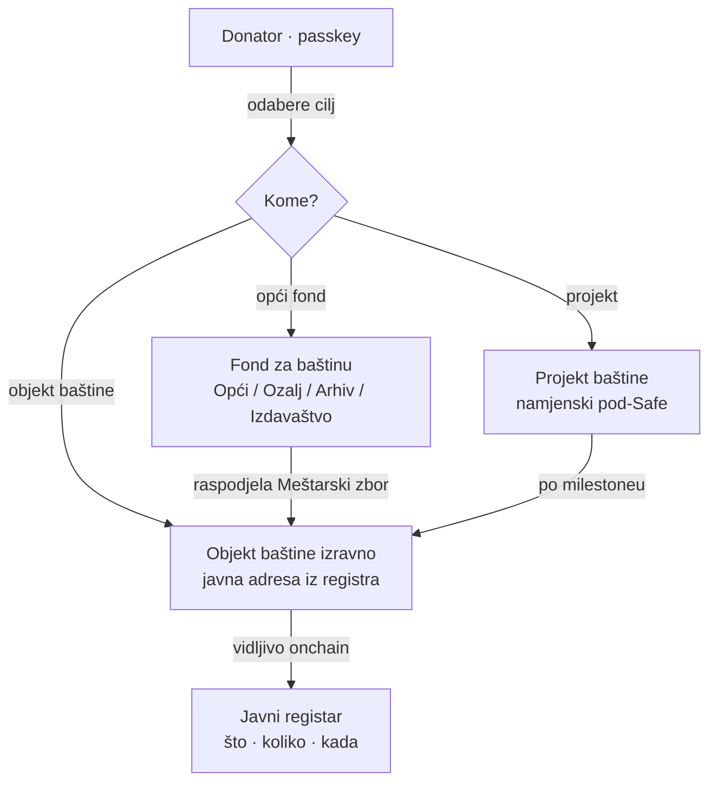
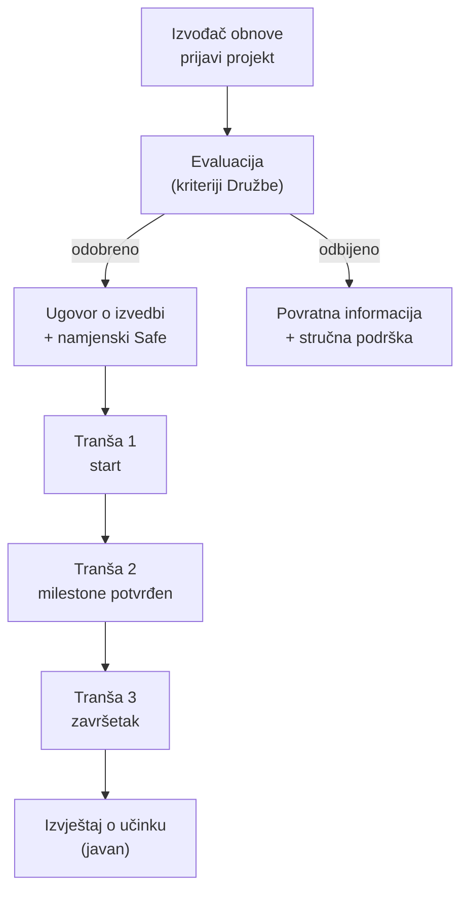
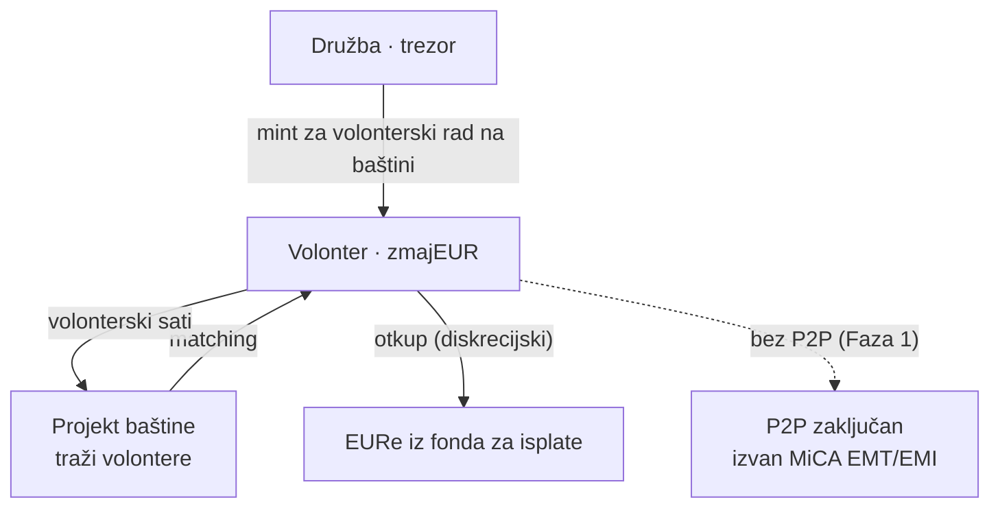
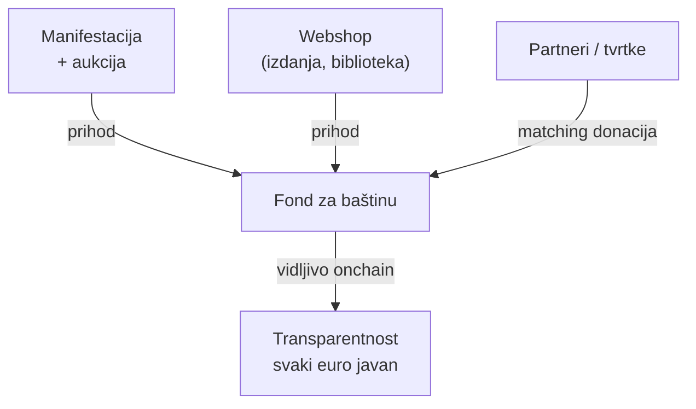
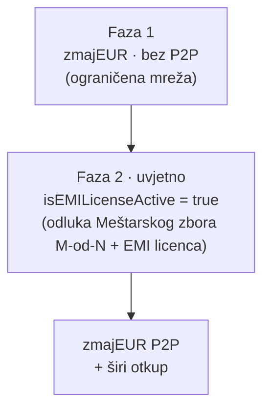
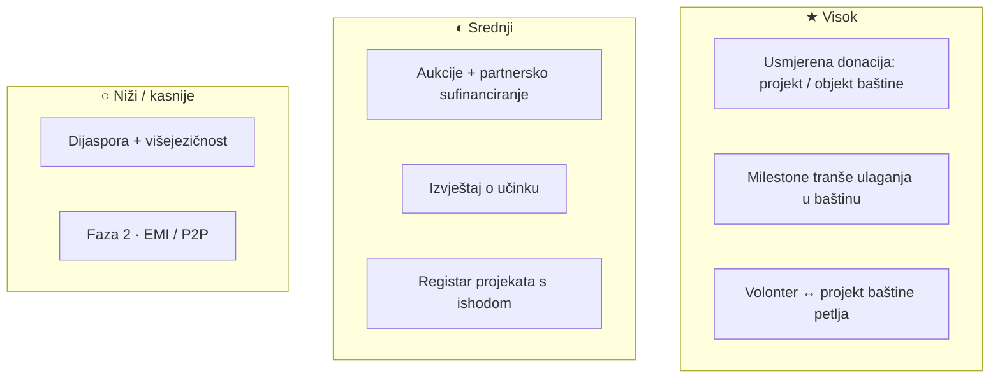

# Razmatrano — moguće funkcionalnosti

> **Što je ovo.** Popis ideja koje su **razmatrane, ali namjerno NISU ugrađene** u
> trenutni prototip (Faza 1). Nije obećanje ni specifikacija — to je **mapa mogućnosti
> za razgovor s Družbom**: kad netko pregledava prototip, ovdje vidi kamo bi se sustav
> mogao razviti. Sve je utemeljeno na **stvarnom radu Družbe „Braća Hrvatskoga Zmaja"**
> (dbhz.hr): očuvanje i obnova hrvatske kulturne i povijesne baštine — obnova Starog grada
> Ozlja, skrb o Kuli nad Kamenitim vratima, digitalizacija Arhiva Frankopana, izdavaštvo
> („Zmajske vijesti", biblioteka „Acta et Studia Draconica"), tečaj glagoljice, podizanje
> spomenika te manifestacije, edukacija i istraživanje.
>
> Oznake prioriteta: **★ visok** (snažno jača prijedlog), **◐ srednji**, **○ niži / kasnije**.
> Logo i ime Družbe koriste se samo za demo; javna upotreba traži suglasnost Družbe.

**Verzija:** nacrt 0.1 · **Datum:** 20. lipnja 2026.

---

## Kako čitati ovu mapu

Trenutni prototip pokriva **donacije**, **donatorsku pretplatu (članarinu)**, **fondove za
baštinu**, **javni registar projekata baštine**, **zmajEUR priznanja za volontere** i
**transparentnost**. Sve ispod su **sljedeći slojevi** — grupirani po temi, svaki s
kratkim *zašto jača prijedlog Družbi*.

---

## 1. Usmjerena donacija — biraš projekt ili objekt baštine ★

Danas donacija i članarina pune **opće fondove za baštinu** (Opći fond Družbe, Fond Stari
grad Ozalj, Fond digitalizacije i arhiva, Fond izdavaštva). Najveća prilika je dati donatoru
izbor: **doniraj izravno odabranom projektu ili objektu baštine**, ne samo fondu — uz puni
onchain trag do primatelja.

- **★ Donacija projektu/objektu baštine iz članarine** — donatorska pretplata se može usmjeriti
  na konkretan cilj (npr. „mjesečno 10 € za obnovu Starog grada Ozalj"), ne samo u opći fond.
- **★ Izbor pri donaciji** — na ekranu *Doniraj* korak „kome": fond · projekt · objekt baštine.
- **Zašto jača prijedlog:** pretvara „doniraj Družbi" u **„podrži baš ovu baštinu"** — veća
  emotivna povezanost, veći iznosi, jasna odgovornost za svaki euro.

---

## 2. Životni ciklus ulaganja u baštinu — prijava, evaluacija, tranše ★

Družba radi po modelu *odabir prioriteta → procjena i konzervatorski uvjeti → izvedba*. Wallet to
može učiniti **sljedivim od prijedloga do isplate**, s isplatom po **milestoneovima** umjesto
odjednom.

- **★ Milestone tranše (escrow)** — sredstva se otključavaju po dokazanom napretku obnove; štiti sredstva
  i donatore, a izvođaču daje jasne ciljeve.
- **◐ Javni registar projekata s ishodom** — transparentno koji je projekt prijavljen, što je odobreno i zašto.
- **Zašto jača prijedlog:** dokazuje da je svako ulaganje u baštinu **odgovorno i etapno** —
  ključno za povjerenje donatora i partnera.

---

## 3. Volontiranje na baštini — zmajEUR petlja ★

zmajEUR je u prototipu neprenosivi (soulbound) token zahvale volonterima. Razmatrano je
**zaokruživanje petlje**: spajanje volontera i projekata baštine, evidencija volonterskih sati i
diskrecijski otkup za EURe iz fonda za isplate.

- **◐ Volonter ↔ projekt baštine matching** — registar volontera po vještini (obnova, digitalizacija, vodstvo, glagoljica); projekt bira, sati se evidentiraju.
- **◐ zmajEUR za radionice i edukacije** — mint za održane tečajeve (npr. glagoljica) i vodstva, ne samo rad na obnovi.
- **○ Otkup-prag i ljestvica** — koliko zmajEUR-a vrijedi koliko EURe, objavljeno unaprijed.
- **Zašto jača prijedlog:** čini **volonterski doprinos baštini** mjerljivim — u duhu gesla
  „Pro aris et focis, Deo propitio!".

---

## 4. Prikupljanje sredstava — aukcije, webshop, partneri ◐

Družba prikuplja i kroz **manifestacije i prigodne događaje** te **prodaju izdanja**. Wallet te tokove
može učiniti transparentnima i povezati ih izravno s fondovima za baštinu.

- **◐ Aukcija onchain** — ulaznice i licitacije evidentirane, prihod automatski u odabrani fond za baštinu.
- **◐ Partnersko sufinanciranje (matching)** — tvrtka udvostruči donacije do iznosa X; jača kampanje obnove.
- **○ Webshop → fond** — prihod od prodaje izdanja (npr. biblioteka „Acta et Studia Draconica") vidljivo sliva u fond.
- **Zašto jača prijedlog:** povezuje **postojeće** kanale prikupljanja s transparentnim trezorom.

---

## 5. Učinak i izvještavanje ◐

Najjači argument Družbi: pokazati **što je ulaganjem postignuto** — ne samo da je isplaćeno.

- **◐ Izvještaj o učinku po projektu** — stanje obnove, otvorenost za posjetitelje, status nakon 6/12 mjeseci.
- **◐ Priče o baštini** — poveznica registra na medijsko praćenje (npr. obnova dvorca u Ozlju, digitalizacija Arhiva Frankopana).
- **○ Potvrda o donaciji** — automatska potvrda za poreznu olakšicu donatora.
- **Zašto jača prijedlog:** transparentnost **po rezultatu**, ne samo po transakciji.

---

## 6. Dijaspora i doseg ○

Misija Družbe je **očuvanje hrvatske baštine** — koja ima snažan odjek i izvan granica. Self-custody
novčanik bez granica prirodno otvara **dijasporu** i inozemne zmajske stolove kao izvor potpore.

- **○ Donacije iz dijaspore** — EURe ulaz bez bankovnog posrednika; „očuvajmo hrvatsku baštinu zajedno".
- **○ Višejezični prikaz registra** — projekti baštine i za partnere i prijatelje izvan RH.
- **Zašto jača prijedlog:** širi bazu donatora izvan lokalnog kruga (uključujući 5 inozemnih zmajskih stolova), uz isti transparentan trag.

---

## 7. Faza 2 — od lojalnosti do reguliranog tokena ○

zmajEUR je u Fazi 1 namjerno **bez P2P** (izvan MiCA EMT/EMI). Razmatrana je nadogradnja koja
otključava prijenos **samo** odlukom multisiga Meštarskog zbora i uz EMI licencu.

- **○ `isEMILicenseActive` flag** — postoji konceptualno; UI „gdje smo sada" nije rađen.
- **Zašto jača prijedlog:** pokazuje **odgovoran, fazni** put — ništa se ne otvara prije licence i odluke Meštarskog zbora.

---

## Sažeti pregled prioriteta

> **Napomena.** Sve gore je **mock-razina razmatranja** za Fazu 1 — nije onchain ni
> obvezujuće. Imena i činjenice temelje se na javnim izvorima (dbhz.hr i medijsko
> praćenje); iznosi su ilustrativni. Logo i ime Družbe „Braća Hrvatskoga Zmaja" koriste se
> isključivo za potrebe demo prototipa. Za bilo koju produkcijsku/javnu primjenu potrebna je
> suglasnost Družbe „Braća Hrvatskoga Zmaja" i pravna potvrda (MiCA/HNB, GDPR, porezno).
