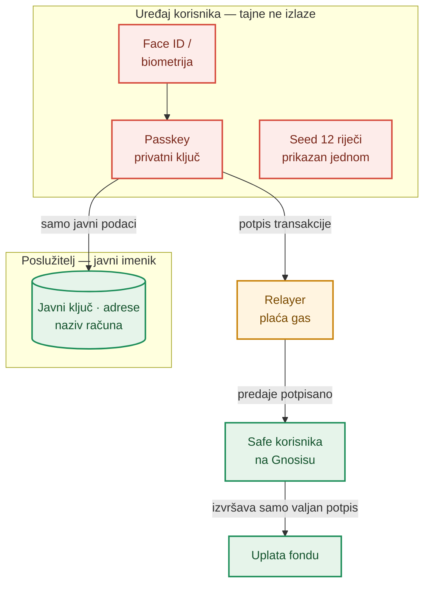
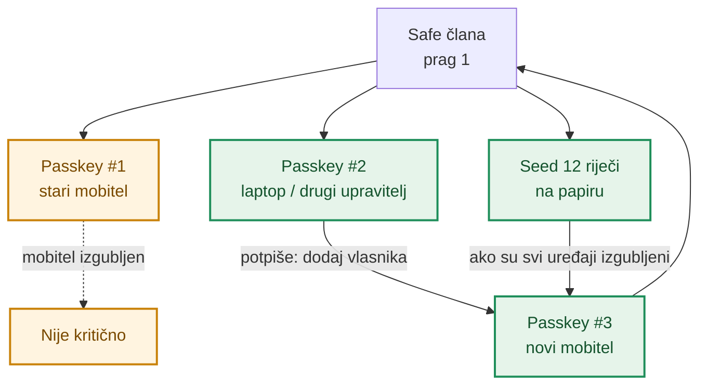
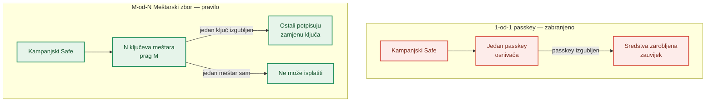
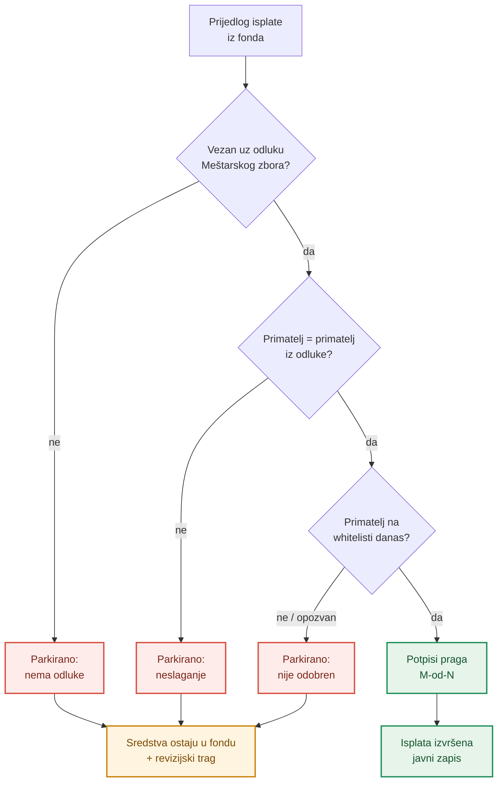

# Sigurnost i skrbništvo — tko drži ključeve

**Izdavatelj:** Družba „Braća Hrvatskoga Zmaja” · OIB: 78879984090 · Kamenita ulica 3, 10000 Zagreb
**Verzija:** nacrt 0.1 · **Datum:** 26. rujna 2026.

> ⚠️ **Napomena.** DBHZ novčanik je u Fazi 1 **dizajnerski prototip s mock podacima** — nema stvarnih ključeva, Safeova ni transakcija. Ovaj dokument opisuje **ciljnu arhitekturu** preuzetu iz DOMOVINA Wallet stacka na kojem se novčanik temelji (odluke o arhitekturi i jedan postmortem tog stacka). Svi iznosi i pragovi za Družbu su **ilustrativni**. Dokument nije pravni ni sigurnosni certifikat; prije produkcije ga treba potvrditi neovisna revizija.

---

## 1. Model skrbništva: sredstva su u Safeu korisnika

Svaki korisnik (donator, član — zmaj) ima vlastiti **Safe** — pametni ugovor novčanika na mreži Gnosis. Vlasnik Safea je korisnikov **passkey**: privatni ključ nastaje i ostaje u sigurnom hardveru uređaja (Secure Enclave / iCloud Keychain / Google Password Manager) i otključava se biometrijom (Face ID / otisak prsta).

Osnovno obećanje: **nitko osim korisnika — ni Družba, ni operater, ni provala u bazu, ni pružatelj oblaka — ne može pomaknuti ni cent bez korisnikove biometrije na njegovu uređaju.**

- Ključevi koji mogu odobriti transakciju (passkey i, ako postoji, 12-riječni seed) **nikad ne napuštaju uređaj** i **nikad se ne spremaju na poslužitelj** — ni šifrirani, ni hashirani, nikako.
- Poslužitelj je **javni imenik** („ovaj passkey upravlja ovim Safeovima”): javni ključ, adrese, naziv računa. Sve to je ionako javno ili na lancu. Potpuni izvoz baze napadaču pokazuje „kartu”, ali mu **ne daje mogućnost potpisa** — dakle ni krađe.
- Ne vrijedi „šifrirajmo tajne na poslužitelju”; vrijedi jače jamstvo: **na poslužitelju nema tajni koje bi se šifrirale.**

### 1.1. Što relayer smije, a što ne

Relayer postoji da korisnik ne mora imati xDAI (gas token). To je **pogodnost, ne skrbnik**:

| Relayer **smije** | Relayer **ne smije / ne može** |
|---|---|
| platiti gas iz vlastitog novčanika | biti vlasnik (owner) ijednog Safea |
| predati na lanac transakciju koju je korisnik **već potpisao** | izmijeniti primatelja, iznos ili podatke — potpis pokriva točno `to / value / data / nonce`, svaka izmjena poništava potpis i Safe je odbija |
| odgoditi ili odbiti predaju (rizik dostupnosti) | krivotvoriti potpis ili pokrenuti transakciju bez biometrije korisnika |

Ako relayer nestane, istu potpisanu transakciju može predati bilo tko (i sam korisnik, plaćajući svoj gas), a Safeom se može upravljati i seedom u standardnom Safe klijentu.

**Iskreno ograničenje (privatnost, ne skrbništvo):** relayer je jedan zajednički novčanik za gas, pa su sve transakcije koje on predaje na lancu međusobno povezive (vidi se da ih je predao isti pošiljatelj). Provala u bazu otkrila bi grupiranje (koji Safeovi pripadaju istom passkeyu). Ni jedno ni drugo ne omogućuje trošenje tuđih sredstava.

---

## 2. Nema oporavka na poslužitelju

U izvornom stacku razmatran je i **odbačen** uobičajeni model „oporavka putem poslužitelja”: poslužiteljski ključ s ovlašću da zamijeni vlasnika Safea nakon SMS provjere (uz odgodu od 24–48 h). Takav model koristi većina „passkey novčanika”, ali je **trajno odbijen**.

**Zašto:** samoskrbništvo ne može biti djelomično. Ako operater ima ključ koji može mijenjati vlasnike, novčanik je u praksi skrbnički — jedan sudski nalog, jedna pogreška ili jedan provaljeni račun u oblaku dijele napadača od svih korisničkih sredstava. Kompromitirani „ključ za oporavak” ispraznio bi sve novčanike odjednom.

Obvezujuća pravila za DBHZ novčanik:

1. **Nijedan ključ koji drži Družba ili operater nema ovlast nad korisničkim Safeovima** — ni ključ za oporavak, ni administratorska uloga u modulima.
2. **Na korisničke Safeove ne dodaje se nijedan modul** koji može mijenjati vlasnike ili micati sredstva.
3. **Jedina uloga relayera na lancu je plaćanje gasa.**
4. **Sve promjene vlasništva potpisuje sam korisnik** svojim postojećim ključem, na lancu.
5. **Ako korisnik trajno izgubi SVE ključeve svog Safea, sredstva su trajno nedostupna.** To je pošten kompromis samoskrbništva i sučelje ga mora jasno reći.

**Posljedica za korisnika:** Družba vam **ne može** „vratiti pristup” ni potvrdom broja mobitela ni e-poštom. SMS ne odobrava ništa na lancu. Zato je vaša zaštita u tome da **na vrijeme imate više od jednog ključa** (§3). Sinkronizacija passkeyeva putem iCloud / Google računa pokriva uobičajeni slučaj — ključ je dostupan na svakom uređaju prijavljenom na isti račun.

---

## 3. Kako član ne izgubi pristup — više passkeyeva i seed

Oporavak se rješava **isključivo na lancu i potpisom korisnika**: Safe može imati više vlasnika s pragom 1 — bilo koji od njih sam potpisuje. Gubitak jednog ključa tada nije problem; problem je samo gubitak **svih**.

- **Više passkeyeva na istom Safeu.** U postavkama „Dodaj passkey”: novi uređaj/upravitelj lozinki stvori passkey, postojeći passkey potpiše dodavanje novog vlasnika (`addOwnerWithThreshold`, prag ostaje 1). Primjeri: iPhone + MacBook, iCloud + Google, hardverski ključ.
- **Seed kao drugi vlasnik (1-od-2).** Zadani način pri otvaranju: vlasnici su **passkey + adresa izvedena iz 12-riječnog seeda**. Seed se generira na uređaju, **prikazuje se samo jednom i samo na izričit dodir**, nikad se ne sprema niti šalje poslužitelju. Uvozom u standardni novčanik (npr. MetaMask / Safe sučelje) upravlja se **istim** Safeom, neovisno o DBHZ aplikaciji.
- **Cijena seeda:** seed je drugi puni ključ — tko ga dozna, može potrošiti sredstva. Zato je opcionalan i **može se kasnije ukloniti** (`removeOwner`) kad korisnik doda druge rezervne ključeve.

**Novi mobitel, u praksi:** ako je passkey sinkroniziran (isti Apple / Google račun), samo se prijavite i potvrdite Face ID-om. Ako nije — dodajte novi passkey potpisom bilo kojeg preostalog ključa (drugi uređaj ili seed). Adresa Safea **ne mijenja se nikad**; mijenja se samo popis vlasnika.

⚠️ Passkey je rizik **dostupnosti**, ne samo sigurnosni dobitak: passkey stvoren u jednom pregledniku ili profilu ne mora se pojaviti drugdje. Pravu mrežu sigurnosti daje drugi vlasnik.

---

## 4. Lekcija iz stvarnog incidenta: kampanjski Safe nikad s jednim passkeyem

**Incident u DOMOVINA Wallet stacku na kojem se temelji ovaj novčanik** (postmortem 0001, 7. lipnja 2026.): testna crowdfunding kampanja primila je **4,16 EURe** na vlastiti kampanjski Safe. Taj Safe imao je **jednog vlasnika — passkey osnivača kampanje, prag 1-od-1**. Kampanja je bila otvorena u nepoznatom pregledniku/profilu; kad se pokušalo pristupiti sredstvima, taj passkey nije se mogao pronaći ni lokalno ni u registru. Isprobani su svi dostupni passkeyevi — nijedan nije odgovarao. Bez drugog vlasnika **nema puta potpisa**: Safe se ne može aktivirati ni isprazniti.

Sredstva nisu uništena (vratila bi se kad bi se izvorni passkey ikad pojavio), ali su operativno otpisana i **namjerno ostavljena zarobljena kao trajna opomena**: *jedan passkey nikad ne smije biti jedini ključ sredstava koja su važna.* Alat za oporavak radio je ispravno — ali nijedan alat ne može stvoriti privatni ključ kojeg nema.

### 4.1. Primjena na Družbu

Namjenski Safeovi Družbe — kampanja **„Bista kralja Tomislava”**, solidarna kampanja **„Obnova krovišta — Stari grad Ozalj”** i **fondovi za baštinu** (Opći fond, Fond „Stari grad Ozalj”, Fond digitalizacije i arhiva, Fond izdavaštva) — drže novac zajednice, ne pojedinca. Zato vrijedi pravilo:

> **Kampanjski i fondovski Safe uvijek je M-od-N multisig Meštarskog zbora — nikad jedan passkey, nikad jedna osoba.**

Prag (npr. 5-od-9 — većina Meštarskog zbora: Veliki meštar + 8 meštara) određuje Meštarski zbor; broj u primjeru je ilustrativan. Gubitak ključa jednog meštra tada je „ne-događaj”: preostali potpisnici ga zamjenjuju na lancu. I obrnuto — nijedan meštar sam ne može isprazniti fond.

### 4.2. Checklista prije otvaranja kampanje ili fonda

- [ ] Safe je M-od-N; vlasnici su ključevi članova Meštarskog zbora, prag zapisan u odluci.
- [ ] Nijedan vlasnik nije „jedini” ključ jedne osobe; svaki meštar ima i svoj rezervni ključ.
- [ ] Prije prve uplate izvršena je **probna transakcija potpisima praga** (dokaz da put potpisa postoji).
- [ ] Popis vlasnika i prag javno su objavljeni uz kampanju.
- [ ] Unaprijed određeni odobreni računi za isplatu (§5) i odredište viška (npr. višak kampanje Ozalj → Fond „Stari grad Ozalj”).
- [ ] Postupak zamjene ključa meštra (gubitak uređaja, kraj mandata) dogovoren prije, ne nakon incidenta.

---

## 5. Isplate iz fondova: samo na odobrene račune (fail-closed)

U izvornom stacku utvrđen je propust: odredište prosljeđivanja čitalo se iz slobodnog teksta uplate, pa je bilo tko mogao odabrati proizvoljnu adresu. Ispravak je **fail-closed** pravilo: prosljeđivanje prolazi samo ako su ispunjena **dva neovisna uvjeta** — odredište je **vezano uz unaprijed autorizirani nalog** i nalazi se na **whitelisti** odobrenih adresa. Sve ostalo se „parkira”: sredstva ostaju u Safeu, zapisuje se razlog, ide upozorenje i zapis u revizijski trag. Opoziv adrese djeluje **odmah**, jer se whitelista provjerava u trenutku isplate, a ne u trenutku stvaranja naloga.

Prilagodba za Družbu (ciljna arhitektura):

- Iz fonda se isplaćuje **samo na unaprijed odobrene račune** — račune Družbe i izvođača radova na baštini — upisane **odlukom Meštarskog zbora**.
- Svaka isplata vezana je uz konkretnu odluku (projekt, iznos, primatelj). Primatelj koji nije na whitelisti ili ne odgovara odluci → isplata se **ne predlaže** i sredstva ostaju u fondu.
- **Promjena whiteliste (dodavanje ili opoziv) je multisig odluka** i **javno je vidljiva** uz fond, s datumom i razlogom.
- Whitelista je dodatni sloj, **ne zamjena** za multisig: stvarnu isplatu i dalje mora potpisati prag Meštarskog zbora na lancu.

**Što whitelista ne rješava:** ako se ukrade ključ sustava koji provodi provjeru, aplikacijska whitelista se može zaobići. Izvorni stack za to ima pripremljen, ali još neizvršen sloj ograničenja na samom lancu (npr. gornja granica po transferu). Za fondove Družbe tu ulogu na lancu ima multisig prag.

---

## 6. Prijetnja → zaštita

| Prijetnja | Zaštita |
|---|---|
| Provala u bazu poslužitelja | Na poslužitelju nema ključeva ni seeda — samo javni podaci; curenje privatnosti, ne krađa |
| Zlonamjeran ili kompromitiran operater / Družba | Nema poslužiteljskog ključa s ovlašću nad korisničkim Safeovima (§2) |
| Relayer mijenja ili izmišlja transakciju | Potpis pokriva točan sadržaj; Safe na lancu odbija svaku izmjenu |
| Relayer ne radi | Istu potpisanu transakciju može predati bilo tko; upravljanje seedom u standardnom klijentu |
| Korisnik izgubi mobitel | Sinkronizirani passkey, drugi passkey ili seed kao drugi vlasnik (§3) |
| Korisnik izgubi sve ključeve | Nema spasa — sredstva trajno nedostupna; zato rezervni ključ na vrijeme |
| Ukraden / otkriven seed | Seed je opcionalan, prikaz samo na dodir, može se ukloniti kao vlasnik |
| SIM-swap / lažna SMS provjera | SMS ne odobrava ništa na lancu |
| Izgubljen jedini ključ kampanjskog Safea | Kampanjski i fondovski Safe uvijek M-od-N Meštarskog zbora (§4) |
| Jedan meštar pokuša sam isplatiti fond | Prag M-od-N — potreban je dogovor zbora |
| Isplata na neodobren račun | Fail-closed whitelista + vezanje uz odluku; promjena whiteliste = multisig, javno (§5) |

---

*Izvori (DOMOVINA Wallet stack): model sigurnosti i skrbništva novčanika; ADR 0001 (nema oporavka na poslužitelju), ADR 0008 (više passkeyeva na istom Safeu), ADR 0012 (seed kao drugi vlasnik), ADR 0016 (fail-closed whitelista isplata); postmortem 0001 (sredstva zarobljena u kampanjskom Safeu sa samo jednim passkeyem). Pravila za Meštarski zbor, fondove i kampanje Družbe su prijedlog za ciljnu arhitekturu i traže odluku Družbe.*
