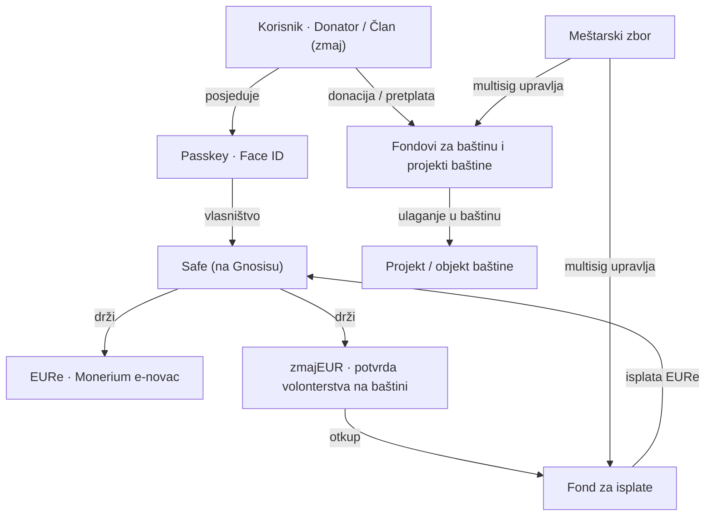
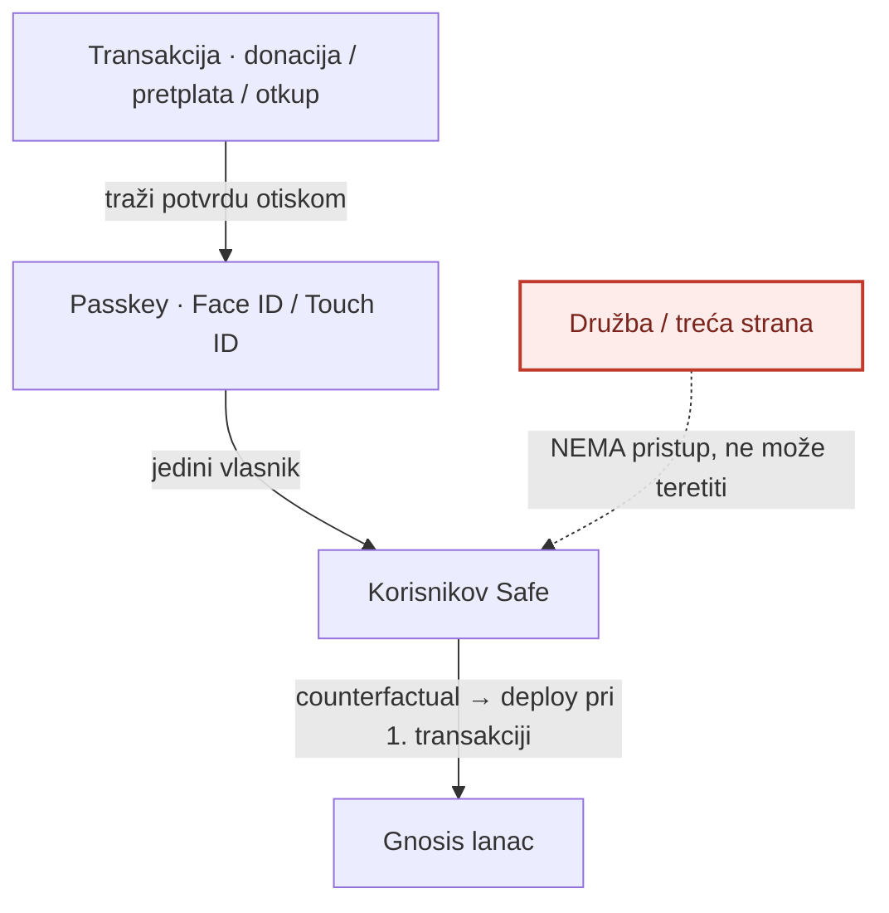
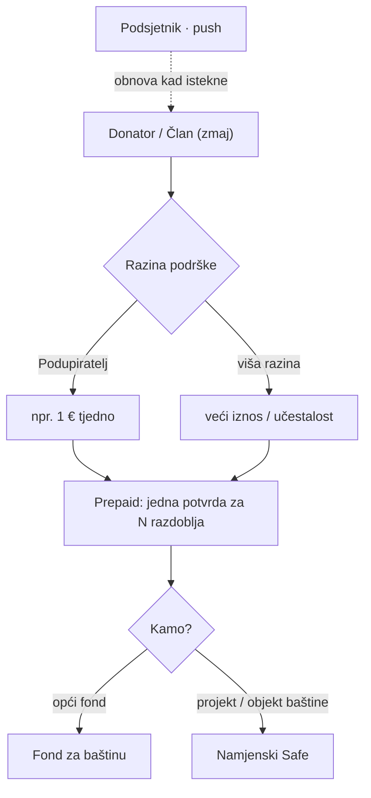
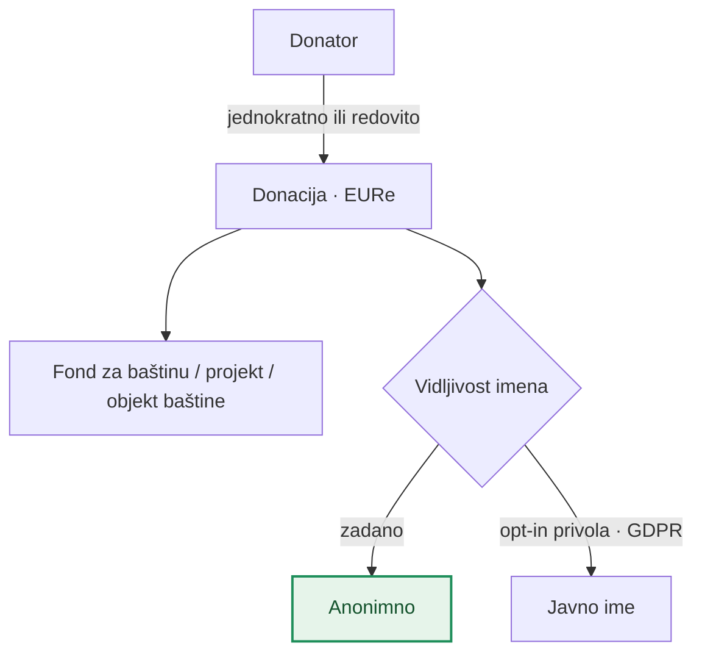
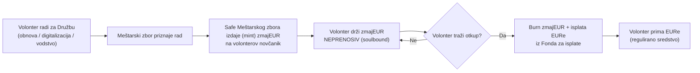
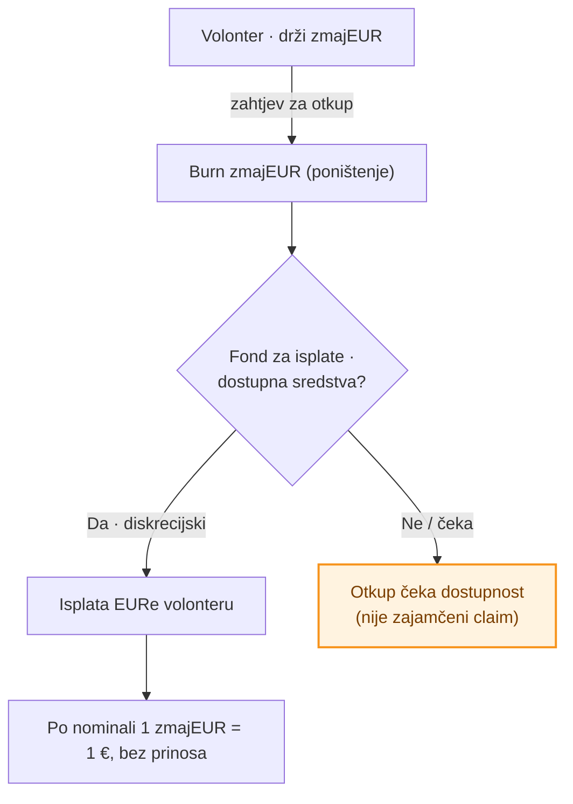
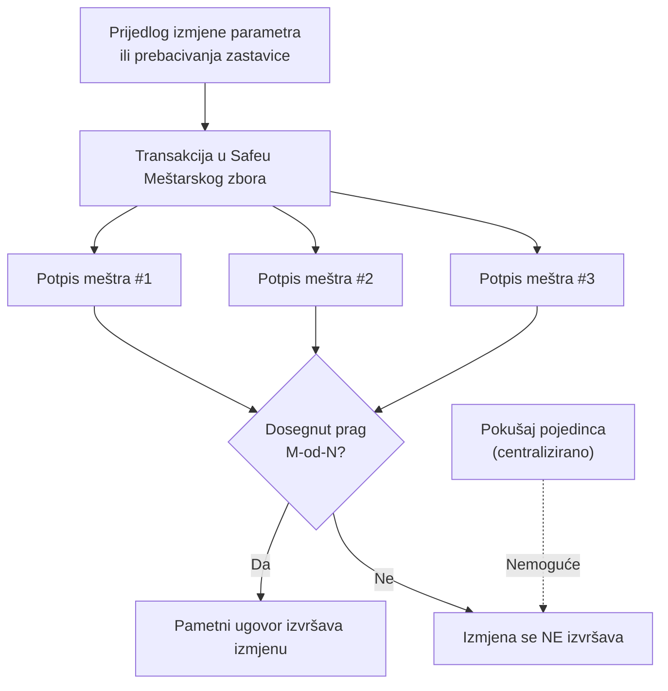
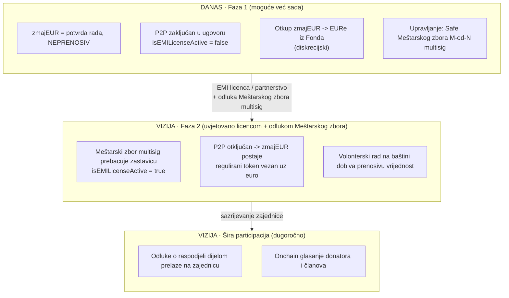

# Uvjeti korištenja — zmajEUR novčanik Družbe „Braća Hrvatskoga Zmaja"

**Izdavatelj:** Družba „Braća Hrvatskoga Zmaja" (lat. *Societas „Fratres Draconis Croatici"*)
**OIB:** 78879984090 · **IBAN:** HR8923400091100055160 (Privredna banka Zagreb / PBZ)
**Sjedište:** Kula nad Kamenitim vratima, Kamenita ulica 3, 10000 Zagreb, Republika Hrvatska
**Registar udruga RH:** reg. br. 00000113 · **Mrežna stranica:** dbhz.hr · **Kontakt:** info@dbhz.hr

**Verzija:** nacrt 0.1 · **Datum:** 20. lipnja 2026.

> ⚠️ **Napomena.** Ovo je nacrt uvjeta korištenja pripremljen kao radni dokument. Prije objave i primjene mora ga potvrditi odvjetnik (područje fintech/MiCA i zaštita podataka). Dokument nije pravni savjet.

---

## 1. Uvodne odredbe

1.1. Ovim se Uvjetima uređuje korištenje aplikacije **zmajEUR novčanik** (dalje: **Novčanik**), digitalne aplikacije koju izdaje Družba „Braća Hrvatskoga Zmaja" (dalje: **Družba**) radi prikupljanja donacija, vođenja donatorske pretplate te financiranja programa očuvanja i obnove hrvatske kulturne i povijesne baštine.

1.2. Korištenjem Novčanika korisnik (dalje: **Donator**, **Član (zmaj)** ili **Korisnik**) potvrđuje da je pročitao, razumio i prihvatio ove Uvjete.

1.3. Misija Družbe je **očuvanje i obnova hrvatske kulturne i povijesne baštine** — skrb o spomenicima, obnova objekata, digitalizacija i vođenje arhiva, izdavaštvo, manifestacije i edukacija, sukladno geslu „Pro aris et focis, Deo propitio!". Družba je nevladina, nepolitička i neprofitna kulturna udruga. Novčanik je alat te misije, a ne sredstvo stjecanja dobiti.

---

## 2. Definicije

- **Novčanik** — samostalna (engl. *self-custody*) aplikacija u kojoj Korisnik isključivo sam upravlja svojim sredstvima putem privatnog ključa zaštićenog biometrijom (Face ID / Touch ID) i sustavom lozinki uređaja (engl. *passkey*). Družba nema pristup sredstvima Korisnika.
- **Safe** — pametni ugovor novčanika (engl. *smart contract wallet*) na mreži **Gnosis**, čiji je vlasnik Korisnikov *passkey*.
- **EURe** — token elektroničkog novca vezan uz euro u omjeru 1:1, koji izdaje licencirana institucija za elektronički novac (Monerium). EURe je regulirano sredstvo i koristi se za stvarne uplate i isplate.
- **zmajEUR** — interni token Družbe koji služi kao **potvrda volonterskog rada na baštini** (rad na obnovi spomenika, vodstvo posjetitelja u Kuli nad Kamenitim vratima, digitalizacija arhiva, istraživanje, tečaj glagoljice). zmajEUR **nije** elektronički novac, nije sredstvo plaćanja i nije investicija (v. poglavlje 6).
- **Donatorska pretplata (članarina)** — dobrovoljni periodični doprinos Donatora/Člana (zmaja), plativ u EURe.
- **Fond za baštinu** — zaseban Safe Družbe vezan uz pojedinu namjenu (Opći fond Družbe, Fond Stari grad Ozalj, Fond digitalizacije i arhiva, Fond izdavaštva), iz kojeg se financira obnova i očuvanje baštine.
- **Projekt / objekt baštine** — namjenski Safe vezan uz konkretan projekt obnove ili očuvanja baštine, na koji Donator može usmjeriti donaciju ili pretplatu.
- **Fond za isplate** — Safe Družbe u kojem se drže EURe namijenjeni otkupu zmajEUR.
- **Meštarski zbor** — upravljačko tijelo Družbe (Veliki meštar i 8 meštara; mandat 5 godina) koje upravlja zajedničkim Safe novčanikom Družbe putem višestrukog potpisa (engl. *multisignature*).

### Odnos entiteta

---

## 3. Novčanik i samostalno upravljanje (self-custody)

3.1. Novčanik je **100 % samostalan**: Korisnikov Safe u vlasništvu je njegova *passkeya*. Družba, kao ni bilo koja treća strana, **ne može** raspolagati sredstvima Korisnika niti izvršiti transakciju bez Korisnikove potvrde biometrijom.

3.2. Svaka transakcija (donacija, pretplata, otkup zmajEUR) izvršava se tek nakon Korisnikove **potvrde otiskom prsta / Face ID-em**.

3.3. Korisnik je **sam odgovoran** za pristup svom *passkeyu*. Gubitak svih pristupnih *passkeya* može značiti trajan gubitak pristupa sredstvima. Družba ne može vratiti izgubljeni pristup umjesto Korisnika.

3.4. Sredstva (EURe) i zapisi (zmajEUR) nalaze se na javnoj mreži Gnosis i **javno su provjerljivi** (v. poglavlje 8).

### Tko može pristupiti sredstvima

---

## 4. Donatori i donatorska pretplata

4.1. **Razine i iznosi.** Donatorska pretplata je **dobrovoljna**. Donator/Član (zmaj) bira razinu podrške (npr. Podupiratelj od **1 € tjedno**). Iznosi i razine utvrđeni su odlukom Družbe (Meštarskog zbora) i mogu se mijenjati odlukom Meštarskog zbora. Za razliku od javnih davanja, pretplata nije obvezna i može se u svako doba zaustaviti.

4.2. **Plaćanje unaprijed (engl. *set & forget*).** Donator može jednom potvrdom platiti pretplatu za više razdoblja unaprijed. Budući da je Novčanik samostalan, **ne postoji automatsko terećenje** — pretplata se plaća unaprijed ili na **podsjetnik** koji Korisnik potvrđuje otiskom prsta.

4.3. **Usmjeravanje na fond, projekt ili objekt baštine.** Donator nije obvezan uplatiti u jedinstveni središnji fond — može sredstva **sam usmjeriti** u odabrani fond za baštinu, na konkretan projekt ili izravno na objekt baštine iz javnog registra. Time Novčanik funkcionira kao platforma za ciljanu potporu očuvanju baštine.

4.4. **Jedinstvena potvrda.** Pri uplati na više ciljeva sve se uplate izvršavaju u **jednoj transakciji** (MultiSend) uz jednu potvrdu otiskom prsta.

### Pretplata i usmjeravanje

---

## 5. Donacije

5.1. Donacije su dobrovoljne, jednokratne ili redovite, u EURe.

5.2. Donacije su prema zadanim postavkama **anonimne**; javno navođenje imena donatora moguće je isključivo uz izričitu privolu Donatora (v. poglavlje 9).

5.3. Donacije se, kao i pretplata, mogu usmjeriti u fond za baštinu ili na konkretan projekt/objekt baštine.

### Tok donacije

---

## 6. zmajEUR — priroda, status i ograničenja

6.1. **Što je zmajEUR.** zmajEUR je interni token koji Družba dodjeljuje volonteru **kao potvrdu obavljenog volonterskog rada na baštini** (rad na obnovi spomenika, vodstvo posjetitelja, digitalizacija arhiva, istraživanje, tečaj glagoljice). Jedan zmajEUR odgovara vrijednosti od 1 € isključivo kao **obračunska jedinica priznanja**.

6.2. **zmajEUR se ne kupuje.** zmajEUR se ne može kupiti za novac; nastaje isključivo izdavanjem (engl. *mint*) od strane Družbe na temelju priznatog rada.

6.3. **zmajEUR je neprenosiv.** Korisnik **ne može** prenijeti zmajEUR drugoj osobi. Pravo na prijenos (P2P) tehnički je onemogućeno na razini pametnog ugovora. zmajEUR je vezan uz volontera.

6.4. **zmajEUR nije novac ni investicija.** zmajEUR nije elektronički novac, nije sredstvo plaćanja na otvorenom tržištu, ne kotira na burzama, nema sekundarno tržište, ne nosi kamatu, prinos ni pravo na dobit. Njegova vrijednost ne može rasti iznad nominale.

6.5. **Pravni okvir.** Zbog svojstava iz točaka 6.2.–6.4. (neprenosivost, zatvoreni krug, nepostojanje tržišta) zmajEUR u trenutnoj fazi predstavlja **instrument programa lojalnosti zatvorenog kruga**, a ne token elektroničkog novca. Detaljna pravna analiza nalazi se u dokumentu [`edeur-loyalty-token.md`](./edeur-loyalty-token.md).

### Životni ciklus zmajEUR

---

## 7. Otkup zmajEUR za EURe

7.1. **Otkup iz Fonda za isplate.** Korisnik može zatražiti zamjenu zmajEUR za EURe iz Fonda za isplate Družbe. Pri otkupu se zmajEUR poništava (engl. *burn*), a Družba isplaćuje odgovarajući iznos u EURe.

7.2. **Diskrecijski karakter otkupa.** Otkup je **naknada koja ovisi o dostupnosti sredstava u Fondu** i odlukama Družbe. zmajEUR **ne predstavlja zajamčeno potraživanje** na isplatu eura na zahtjev. Ova je odredba bitna za pravni status zmajEUR-a i ne smije se tumačiti kao obećanje isplate.

7.3. **Bez prinosa.** Otkup se obavlja po nominali 1 zmajEUR = 1 €; ne postoji prinos ni uvećanje vrijednosti.

### Tok otkupa zmajEUR → EURe

---

## 8. Transparentnost

8.1. Sve uplate i isplate (donacije, pretplate, ulaganja u baštinu, otkupi) javno su i nepromjenjivo zabilježene na mreži Gnosis te provjerljive svakoj javnosti.

8.2. Identitet donatora nije javan osim uz izričitu privolu (poglavlje 9); javno je vidljiv **iznos i namjena** (koji fond / projekt / objekt baštine), sukladno načelu potpune transparentnosti Družbe.

---

## 9. Zaštita podataka (GDPR)

9.1. Družba obrađuje osobne podatke u skladu s Općom uredbom o zaštiti podataka (GDPR) i propisima RH.

9.2. Donacije su prema zadanim postavkama **anonimne**. Javno navođenje imena moguće je samo na temelju izričite, dobrovoljne i opozive privole Korisnika.

9.3. Projekti i objekti baštine u javnom registru objavljuju se isključivo uz privolu nositelja projekta; bez privole prikaz je pseudonimiziran. Korisnik ima prava pristupa, ispravka, brisanja i prigovora sukladno GDPR-u; zahtjevi se upućuju putem kontakta info@dbhz.hr.

---

## 10. Upravljanje izmjenama — višestruki potpis (decentralizacija)

10.1. **Zajednički Safe Družbe.** Riznicu Družbe, fondove za baštinu, Fond za isplate i parametre pametnih ugovora (uključujući pravila izdavanja zmajEUR-a) ne kontrolira nijedan pojedinac. Njima upravlja **Meštarski zbor putem Safe novčanika s višestrukim potpisom (multisignature)** uz konfigurirani **prag potpisa M-od-N** (npr. 5 od 9 — većina Meštarskog zbora; ilustrativno).

10.2. **Nijedna izmjena nije centralizirana.** Bilo koja izmjena parametara ili prebacivanje zastavica (v. poglavlje 11) može se izvršiti **isključivo** ako potreban broj meštara potpiše transakciju. Pojedini meštar ne može sam izvršiti izmjenu.

10.3. **Pravičnost i provjerljivost.** Svako potpisivanje i svaka izmjena javno su zabilježeni na lancu, pa su odluke Meštarskog zbora transparentne i provjerljive.

### Upravljanje izmjenom (M-od-N multisig)

---

## 11. Faze razvoja — danas i vizija

11.1. **Faza 1 (danas).** zmajEUR je neprenosivi instrument lojalnosti zatvorenog kruga. Pravo na P2P prijenos onemogućeno je u pametnom ugovoru (zastavica `isEMILicenseActive = false`). Novčanik gradi zajednicu volontera i podupiratelja baštine, a zmajEUR priznaje volonterski rad na baštini.

11.2. **Faza 2 (vizija — uvjetovano).** Ako zajednica postane održiva i Družba **ishodi licencu institucije za elektronički novac (EMI)** ili sklopi partnerstvo s licenciranim izdavateljem, Meštarski zbor može **odlukom putem višestrukog potpisa** prebaciti zastavicu (`isEMILicenseActive = true`), čime se P2P prijenos otključava i zmajEUR može postati regulirani token vezan uz euro. Time volonterski rad na baštini dobiva stvarnu, prenosivu vrijednost.

11.3. **Bez obećanja i bez očekivanja dobiti.** Prelazak u Fazu 2 **nije zajamčen** i ovisi o pravnim preduvjetima i odluci tijela Družbe. zmajEUR se ne smije stjecati s očekivanjem buduće dobiti; on je i ostaje potvrda rada. Sama zastavica ne stvara pravo na P2P — pravni temelj je licenca/partnerstvo.

11.4. **Šira participacija (dugoročna vizija).** Dugoročno je cilj da odluke o parametrima i raspodjeli sredstava za baštinu dijelom prijeđu s Meštarskog zbora na **širu zajednicu donatora i članova**, kroz onchain glasanje o raspodjeli sredstava među fondovima i projektima.

### Što je moguće danas, a što je vizija

---

## 12. Rizici i odricanje od odgovornosti

12.1. **Samostalno upravljanje.** Korisnik je sam odgovoran za sigurnost svog *passkeya*. Gubitak pristupa može biti nepovratan.

12.2. **Tehnološki rizik.** Korištenje blockchain mreže nosi tehničke rizike (greške u ugovorima, zastoji mreže). Družba ulaže razuman napor u sigurnost, ali ne jamči neprekidan rad.

12.3. **zmajEUR nije ulaganje.** zmajEUR ne nosi pravo na dobit ni povrat; ne smije se tumačiti kao financijski instrument.

12.4. Družba ne odgovara za štetu nastalu zlouporabom uređaja Korisnika ili gubitkom pristupnih podataka koji su isključivo u Korisnikovoj domeni.

---

## 13. Završne odredbe

13.1. Na ove se Uvjete primjenjuje pravo Republike Hrvatske.

13.2. Družba može izmijeniti Uvjete; o bitnim izmjenama Korisnici će biti obaviješteni putem aplikacije ili e-pošte.

13.3. Za sva pitanja: kontakt putem **info@dbhz.hr** odnosno **dbhz.hr**.

---

> **Napomena o demo prototipu.** Logo i ime Družbe „Braća Hrvatskoga Zmaja" koriste se isključivo za potrebe demo prototipa. Za bilo koju produkcijsku ili javnu primjenu potrebna je suglasnost Družbe te pravna potvrda.

*Kraj nacrta. Sve odredbe podložne pravnoj potvrdi prije objave.*
